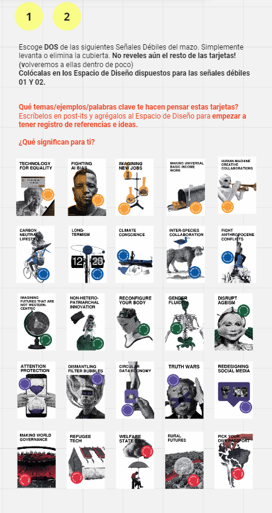
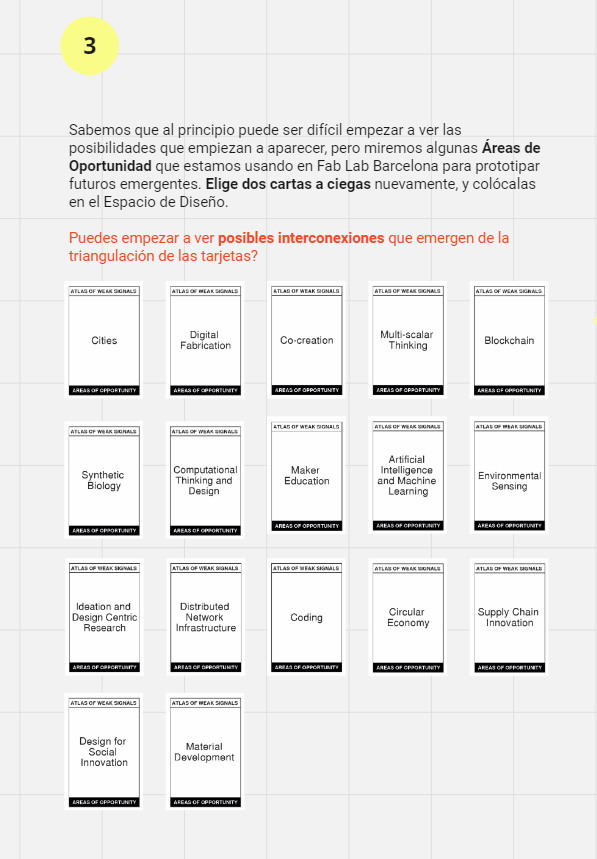

---
hide:
    - toc
---

# MD01 - Proyecto y Contexto

Los módulos de diseño (MD) representan una parte integral del eje temático de diseño en el contexto educativo de esta especialización. Estas unidades curriculares están diseñadas para sumergirnos en el fascinante mundo del diseño, abordando una amplia gama de aspectos fundamentales para el desarrollo de proyectos en diversas disciplinas. Al centrarse en el proceso de diseño en su totalidad, los MD ofrecen una experiencia educativa enriquecedora que va más allá de simplemente crear productos o soluciones.

Consideron son una oportunidad para explorar y comprender la complejidad del diseño en sus múltiples dimensiones. Desde la conceptualización inicial hasta la implementación final, marcando un viaje de descubrimiento que abarca la interacción entre el proyecto y su entorno, las metodologías de diseño pertinentes (como el Aprendizaje Basado en Proyectos - ABP), la colaboración en el diseño distribuido, el prototipado y la fabricación.

En resumen, los módulos de diseño son mucho más que simples cursos; representan una plataforma dinámica y colaborativa donde podemos desarrollar habilidades fundamentales en diseño, explorar nuevas ideas y enfoques, y prepararse para enfrentar los desafíos del mundo real con confianza y creatividad.

Para el desarrollo del presente vimos diferentes herramientas como lo son: 

{ align=left }

Miro es una aplicación de colaboración en línea que permite a equipos trabajar juntos de manera remota en proyectos creativos, de planificación y de resolución de problemas. La aplicación proporciona una pizarra digital flexible donde los usuarios pueden crear y organizar diversos tipos de contenido, como notas adhesivas, diagramas, dibujos, imágenes y más.

Miro es conocido por su capacidad para facilitar la colaboración en tiempo real, lo que permite que varios usuarios trabajen juntos simultáneamente desde diferentes ubicaciones geográficas. Esto hace que sea una herramienta especialmente útil para equipos distribuidos o aquellos que trabajan de forma remota. En base a esta colaboración en tiempo real, se fuerond desarrollando las diferentes clases, compartiendo el trabajo individual con el grupo de trabajo asignado.

{ align=right }

ChatGPT es parte de la familia de modelos de inteligencia artificial desarrollados por OpenAI, específicamente basado en la arquitectura GPT (Generative Pre-trained Transformer).

El propósito principal del mismo, es entender y generar texto en lenguaje natural para participar en conversaciones y asistir en una variedad de tareas, desde responder preguntas y proporcionar información hasta generar contenido creativo y ayudar en la resolución de problemas. Está entrenado en una amplia gama de temas y tiene acceso a una gran cantidad de conocimientos recopilados de diversas fuentes en línea.

En resumen, es un modelo de inteligencia artificial diseñado para comprender y producir texto humano de manera coherente y relevante, con el objetivo de brindar asistencia y participar en interacciones de manera similar a como lo haría una persona real.

## Proceso Realizado

Primeramente, recibimos una presentación y explicación de Jana quien fue nuestra docente para el presente módulo, en la primera clase hablamos de las Señales Débiles y como esta inciden en nuestros proyectos.

<figure markdown="span">
  { width="600"}
</figure>

Luego, elegimos dos Señales Débiles para colocarlas en el tablero proporcionado y desarrollar lo que para nosotros era cada una de las elegidas, en mi caso tome dos: Truth Wars (Guerras de la Verdad) y Circular Data Economy (Economía Circular de Datos):

<figure markdown="span">
  { width="600"}
</figure>

A partir de ellas, busqué el significado de ellas e información pertinente para interiorizarme de qué significaban cada una de ellas y lo coloqué en un post it, respondiendo a la pregunta: ¿Qué significan para tí?

<figure markdown="span">
  { width="600"}
</figure>

Luego para reforzar el que significan para mí intente contextualizarlas un poco más con un conjunto de ejemplos donde veo el concepto "bajado a tierra":

<figure markdown="span">
  { width="600"}
</figure>

En este momento, pasé a las Áreas de Oportunidad, donde debía elegir dos para buscar posibles interconexiones con las anterioremente elegidas Señales Débiles:

<figure markdown="span">
  { width="600"}
</figure>

En mi caso elegí dos: Digital Fabrication (Fabricación Digital) y Artificial Intelligence and Machine Learning (Inteligencia Artificial y Machine Learning):

<figure markdown="span">
  { width="600"}
</figure>

## Miro Realizado: *[@grupo4-efdi](https://miro.com/app/board/uXjVKQD5ciI=/)*
