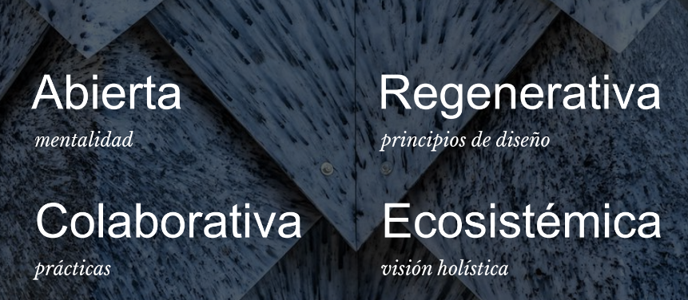
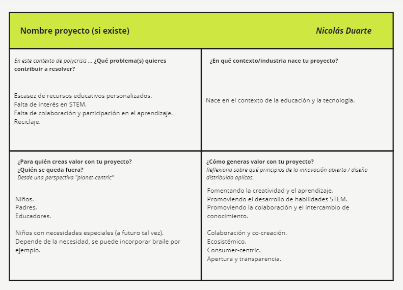

---
hide:
    - toc
---

# MI01 - Innovación Abierta y Distribuida

## Introducción

En el marco de la Especialización en Fabricación Digital e Innovación, el eje temático de innovación y sostenibilidad juega un papel crucial. Comprende una serie de unidades curriculares denominadas módulos de innovación (MI), los cuales están diseñados para explorar y aplicar metodologías de innovación con un enfoque sostenible. La sostenibilidad se aborda de manera integral, considerando las dimensiones social, económica y ambiental, lo que nos permite a los estudiantes desarrollar soluciones innovadoras que no solo son eficaces, sino también responsables y sostenibles a largo plazo.

En este contexto, la documentación del Módulo MI01 se centra en detallar las actividades, metodologías y aprendizajes obtenidos durante la primera intancia del MI de esta especialización. A través de esta documentación, se busca no solo registrar el proceso de aprendizaje, sino también reflexionar sobre la aplicación práctica de las metodologías de innovación sostenibles y su impacto potencial en las diferentes dimensiones abordadas.

Para llevar a cabo el trabajo del módulo trabajamos con una herramienta en particular que fue:

{ align=left }

Miro es una aplicación de colaboración en línea que permite a equipos trabajar juntos de manera remota en proyectos creativos, de planificación y de resolución de problemas. La aplicación proporciona una pizarra digital flexible donde los usuarios pueden crear y organizar diversos tipos de contenido, como notas adhesivas, diagramas, dibujos, imágenes y más.

Miro es conocido por su capacidad para facilitar la colaboración en tiempo real, lo que permite que varios usuarios trabajen juntos simultáneamente desde diferentes ubicaciones geográficas. Esto hace que sea una herramienta especialmente útil para equipos distribuidos o aquellos que trabajan de forma remota. En base a esta colaboración en tiempo real, se fuerond desarrollando las diferentes clases, compartiendo el trabajo individual con el grupo de trabajo asignado.

## Proceso Realizado

Primeramente, recibimos una presentación y explicación de Paola quien fue nuestra docente para el presente módulo, en la primera clase hablamos de temas relacionados con proyectos, metodologías de innovación y sus aplicaciones en diversos ámbitos relacionados a la producción y el diseño, con un enfoque sostenible. Sobre todo nos centramos en el concepto de Opensource, Colaborativo, Regenerativo/Sostenible y Ecosistémico, todos estos aplicados a proyectos, con diferentes ejemplos de proyectos reales los cuales estaban muy interesantes y personalmente desconocía.

<figure markdown="span">
  { width="600"}
</figure>

Una vez finalizada la charla de orden teórica, realizamos un pequeño ejercicio en la herramienta Miro, donde la idea era pensar juntos sobre un proyecto, relacionandolo con los conceptos tratados con anterioridad, este proyecto podría ser o el proyecto final de EFDI, en el caso de que lo tuviéramos pensado, o algun otro proyecto que nos imagináramos, donde aplicar los conceptos teóricos.

<figure markdown="span">
  { width="600"}
</figure>

Como se puede ver, se nos otorgó un template base para desarrollar el proyecto y relacionarlo en 4 tópicos, con preguntas disparadoras como: 
¿Qué problema(s) quires contribuir a resolver?
¿En qué contexto/industria nace tu proyecto?
¿Para quién creas valor con tu proyecto? 
¿Quién se queda fuera?
¿Cómo generas valor con tu proyecto? 

<figure markdown="span">
  { width="600"}
</figure>

Y como ejemplo teniamos uno realizado a la derecha, que implicaba un proyecto realizado por Paola, para tomarlo de ejemplo a la hora de desarrollar el propio.
Para realizar el ejercicio, tal cual indicó Paola, tome uno de los espacios vacíos para ir completandolo, en mi caso aun no tengo un proyecto definido, pero este enfoque que Paola nos plantea, me ayudo a ir realizando una idea de proyecto final, que antes de la clase no la tenía presente, resultando en el siguiente cuadro:

<figure markdown="span">
  { width="600"}
</figure>

En base a lo comentado por Paola, intenté relacionar los conceptos y las preguntas disparadoras a un proyecto que abarcara estos tópicos, resultandome una idea: realizar un proyecto open-source, que implique el diseño de material didáctico para niños o adolescentes, pero fabricado con filamentos reciclados de computadoras de Ceibal. Entonces mi idea es diseñar las diferentes herramientas o kits didácticos y que la fabricación se realice en base a reciclaje.

Al finalizar la clase, nos llevamos un deber, que era investigar proyectos donde se aplique un enfoque abierto y distribudo, en mi caso y relacionandolo la idea busque proyectos de filamento reciclado en Uruguay y justamente me tope con la empresa Kenistech, que realiza filamento a partir de carcasas de computadoras y tablets dadas de baja por el plan Ceibal. (Abajo a la Izquierda)

<figure markdown="span">
  { width="600"}
</figure>

En la segunda clase, primeramente comentamos algunas de las propuestas del Moodboard colaborativo de proyectos y posteriormente nos embarcamos en un ejercicio grupal, donde se presentaron tres proyectos a comentar y uno de ejemplo, donde todos tenian caracteristicas de open-source, colaborativos y regenerativos, para ello, se armaron tres espacios de trabajo en zoom, donde cada estudiante se iba al que le parecía más interesante. En cada una de las características, se tenian varias preguntas disparadoras para discutir en los espacios de trabajo.

<figure markdown="span">
  { width="600"}
</figure>

En mi caso particular, elegí el proyecto de Making Sense a comentarse y discutir sobre él en base a las preguntas, asignandome por mi cuenta al espacio de trabajo dos:

<figure markdown="span">
  { width="600"}
</figure>

En este momento, junto con mis compañeros, nos dedicamos a investigar a fondo sobre el tema de la innovación sostenible aplicada a MakingSense. Durante nuestra charla, discutimos extensamente sobre el proyecto en cuestión, el cual se caracteriza por ser de código abierto (open-source). Sin embargo, descubrimos que, aunque es un proyecto colaborativo, no es tan abierto como habíamos pensado. Esto significa que, si bien cualquier persona puede contribuir, existen ciertos límites a la hora de acceder a los componentes para realizar el sensor.

La naturaleza colaborativa del proyecto se evidenció en la participación activa de los vecinos de la Plaza del Sol de Barcelona. Los residentes locales jugaron un papel crucial al recabar datos sobre ruidos molestos en su entorno. Esta recopilación de información fue fundamental para identificar los problemas de ruido en la zona y permitió que la comunidad pudiera plantear acciones concretas con el municipio para abordar estos problemas. Esta colaboración no solo facilitó una mejor situación, sino que también promovió un sentido de pertenencia y responsabilidad entre los ciudadanos, quienes vieron sus esfuerzos reflejados en iniciativas reales y efectivas.

El proyecto es regenerativo, lo que significa que no solo busca solucionar un problema específico, sino que también tiene como objetivo aumentar el bienestar general de los usuarios involucrados. Este bienestar se extiende más allá de los seres humanos, incluyendo tanto seres vivos como no vivos en el ecosistema urbano. Por ejemplo, la reducción de ruidos molestos no solo mejora la calidad de vida de los residentes humanos, sino que también crea un ambiente más armonioso para la fauna urbana.

## Concluciones 

Este primer módulo de innovación abierta y distribuida me proporcionó una comprensión profunda y multifacética de cómo las metodologías de innovación pueden ser aplicadas de manera efectiva en diversos ámbitos relacionados con la producción y el diseño, siempre con un enfoque sostenible. A lo largo del módulo, hemos explorado y discutido temas cruciales que abarcan desde proyectos de código abierto (opensource) hasta iniciativas colaborativas, regenerativas/sostenibles y ecosistémicas.

Uno de los aspectos más destacados del módulo fue el análisis del concepto de opensource. Aprendi cómo los proyectos de código abierto permiten una transparencia y accesibilidad que fomentan la innovación continua y la mejora colaborativa. Aunque decubramos que no todos los proyectos opensource son tan abiertos como se podría esperar, la mayoría de ellos ofrece una plataforma donde múltiples actores pueden contribuir y beneficiarse mutuamente.

El enfoque colaborativo fue otro pilar fundamental del módulo. A través de ejemplos concretos, como la participación de los vecinos de la Plaza del Sol en Barcelona en la recolección de datos sobre ruidos molestos, podemos observar cómo la colaboración entre ciudadanos puede llevar a la implementación de acciones efectivas y tangibles. Este tipo de proyectos no solo fomenta la inclusión y el empoderamiento comunitario, sino que también facilita soluciones más precisas y adaptadas a las necesidades locales.

La dimensión regenerativa y sostenible de los proyectos que discutimos demostró cómo la innovación puede ir más allá de la simple resolución de problemas para promover un bienestar integral. Proyectos que no solo buscan reducir impactos negativos, sino que también mejoran activamente las condiciones de vida de las comunidades y los ecosistemas, son ejemplos inspiradores de cómo la sostenibilidad puede integrarse en todos los niveles de diseño y producción.

El enfoque ecosistémico nos permitió ver la interconexión entre los diferentes elementos de un proyecto, considerando tanto los seres vivos como no vivos. Esta perspectiva holística es crucial para desarrollar soluciones que sean realmente sostenibles a largo plazo bajo mi punto de vista.

Los diversos ejemplos de proyectos reales que analizamos fueron sumamente enriquecedores y muchos de ellos eran desconocidos para mí antes de este módulo. Estos casos prácticos no solo ilustraron la teoría que estudiamos, sino que también proporcionaron inspiración y modelos a seguir para futuros proyectos en los que podamos estar involucrados.

Además, este módulo ha sentado, o al menos tendido a sentar, las bases para mi proyecto final en la Especialización en Fabricación Digital e Innovación. Al integrar los principios de innovación abierta, colaboración y sostenibilidad, podré diseñar un proyecto que no solo sea técnicamente correcto sino también socialmente inclusivo y ambientalmente responsable. La comprensión de cómo involucrar a diversas partes interesadas y aprovechar el poder de las comunidades y generar soluciones efectivas será invaluable. Asimismo, el enfoque en proyectos regenerativos y ecosistémicos me permitirá considerar el impacto a largo plazo de mis propuestas, asegurando que contribuyan positivamente al bienestar general de todos los elementos del sistema. Este conocimiento y estas habilidades son fundamentales para enfrentar los desafíos actuales de manera innovadora y sostenible, y estoy seguro de que serán cruciales para el éxito de mi proyecto final, llevándome a crear soluciones que realmente marquen la diferencia.
