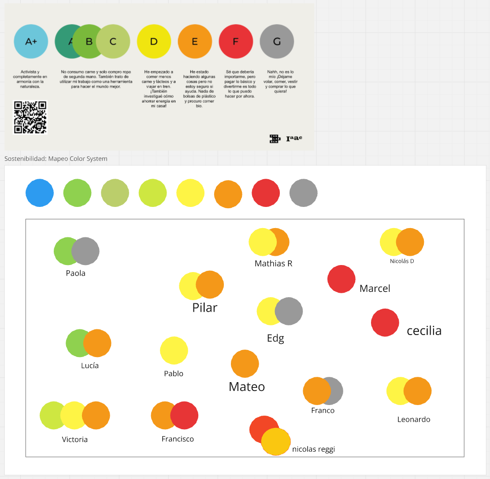
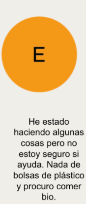
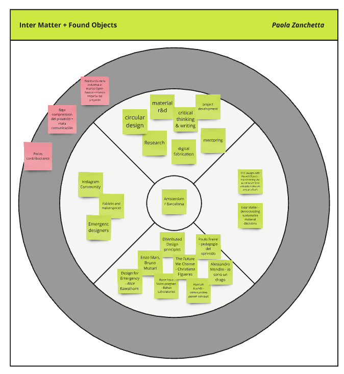
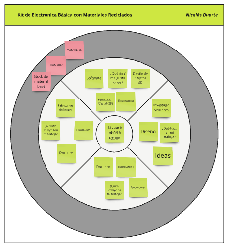

---
hide:
    - toc
---

# MI02 - Desarrollo Sostenible y Economia Circular

## Introducción

En el marco de la Especialización en Fabricación Digital e Innovación, el eje temático de innovación y sostenibilidad juega un papel crucial. Comprende una serie de unidades curriculares denominadas módulos de innovación (MI), los cuales están diseñados para explorar y aplicar metodologías de innovación con un enfoque sostenible. La sostenibilidad se aborda de manera integral, considerando las dimensiones social, económica y ambiental, lo que nos permite a los estudiantes desarrollar soluciones innovadoras que no solo son eficaces, sino también responsables y sostenibles a largo plazo.

En este contexto, la documentación del Módulo MI02 se centra en detallar las actividades, metodologías y aprendizajes obtenidos durante la primera intancia del MI de esta especialización. A través de esta documentación, se busca no solo registrar el proceso de aprendizaje, sino también reflexionar sobre la aplicación práctica de las metodologías de innovación sostenibles y su impacto potencial en las diferentes dimensiones abordadas.

Para llevar a cabo el componente de Desarrollo Sostenible y Economía Circular del MI02, trabajamos a lo largo de diferentes encuentros de videoconferencia con Paola, nuestra docente, en base a la herramienta:

{ align=left }

Miro es una aplicación de colaboración en línea que permite a equipos trabajar juntos de manera remota en proyectos creativos, de planificación y de resolución de problemas. La aplicación proporciona una pizarra digital flexible donde los usuarios pueden crear y organizar diversos tipos de contenido, como notas adhesivas, diagramas, dibujos, imágenes y más.

Miro es conocido por su capacidad para facilitar la colaboración en tiempo real, lo que permite que varios usuarios trabajen juntos simultáneamente desde diferentes ubicaciones geográficas. Esto hace que sea una herramienta especialmente útil para equipos distribuidos o aquellos que trabajan de forma remota. En base a esta colaboración en tiempo real, se fuerond desarrollando las diferentes clases, compartiendo el trabajo individual con el grupo de trabajo asignado.

## Proceso Realizado

Comenzamos con una presentación teórica por parte de la docente y luego nos pasamos a trabajar con un sistema de mapeo de colores relacionado con la sostenibilidad. Cada color representa diferentes grados de compromiso o hábitos sostenibles, desde el color azul A+ hasta el color gris G. Donde en base a cada color y su descripción debíamos realizar el ejercicio para indicar el nivel/contacto que tenemos con la sostenibilidad en nuestros casos particulares.

Esto fue sumamente interesante, porque nos hace parar un poco y reflexionar sobre el tema y sobre el contacto que tenemos con la sostenibilidad, llegando al punto de evaluar de manera personal, que tan comprometidos estamos con esto, lo que lleva a implicar debates o reflexiones sobre cómo cada compañero puede mejorar en áreas relacionadas con la economía circular, reciclando, reduciendo el consumo, o adoptando hábitos más responsables.

<figure markdown="span">
  { width="800"}
</figure>

En mi caso, el "mapeo" de sostenibilidad muestra que me encuentro en una etapa intermedia en términos de conciencia y prácticas sostenibles. Los colores que siento me representan son el amarillo y el naranja, lo que indica que he comenzado a adoptar ciertos hábitos más sostenibles, aunque todavía tengo áreas en las que puedo mejorar.

El color amarillo sugiere que estoy tomando decisiones conscientes, como reducir el consumo de carne o comenzar a interesarme por prácticas ecológicas, pero aún no las he integrado completamente en mi vida cotidiana. Por otro lado, el color naranja refleja que he empezado a hacer algunos cambios más significativos, pero todavía me falta avanzar hacia un compromiso más profundo con la sostenibilidad.

Este ejercicio me ayudo mucho a reflexionar sobre mi rol en el cuidado del medio ambiente y en qué áreas puedo ser más proactivo para contribuir a una economía circular más robusta.

<figure markdown="span">
  { width="800"}
</figure>

<figure markdown="span">
  { width="800"}
</figure>

<figure markdown="span">
  { width="800"}
</figure>

Luego la profesora y alguno de nosotros compartimos recursos/materiales sobre distintas vertientes relevantes a la temática, como pueden ser Sostenibilidad, Diseño Circular, Storytelling y Diseño.

<figure markdown="span">
  { width="800"}
</figure>

## Ejercicio 1:

Para el primer ejercicio, se nos compartió una base de este mismo ejercicio aplicado a un proyecto de Paola, llamado Inter Matter + Found Objects en conjunto con un template, para que tomaramos estos como ejemplo para realizar el ejercicio aplicandolo a nuestra idea de proyecto final para EFDI.

<figure markdown="span">
  { width="800"}
</figure>

<figure markdown="span">
  { width="800"}
</figure>

El ejercicio consistió en mapear diferentes elementos clave relacionados con un proyecto de investigación o diseño basado en la sostenibilidad, la economía circular, y el trabajo colaborativo, mientras se analizan los desafíos enfrentados. Esto entiendo nos ayuda a visualizar cómo se interconectan diversas disciplinas y contribuyentes, y a identificar áreas que necesitan mayor atención o solución de problemas.
En mi caso, aplicando el ejercicio a mi idea resultó lo siguiente:

<figure markdown="span">
  { width="800"}
</figure>

Al aplicar este ejercicio a mi proyecto final de la EFDI, me ayuda a visualizar de manera más clara las conexiones entre los diferentes elementos que forman parte de mi proyecto y los desafíos que puedo enfrentar. El mapeo de conceptos como el diseño circular, la investigación y desarrollo de materiales, y la fabricación digital se alinean perfectamente con mis objetivos de crear un kit educativo a partir de materiales reciclados. Este ejercicio no solo me permite identificar las áreas clave que debo fortalecer, sino también reflexionar sobre los obstáculos, como la comunicación y la colaboración con la comunidad, que podrían estar limitando el impacto del proyecto.

Al observar los retos identificados, me doy cuenta de que el éxito del proyecto no depende únicamente de mi capacidad técnica o de los recursos disponibles, sino también de la manera en que logro involucrar a los demás y comunicar el valor del proyecto.

Impulsa a pensar de manera más estratégica, no solo en los aspectos técnicos, sino también en los elementos sociales y colaborativos que pueden marcar la diferencia en la implementación exitosa del proyecto. Me llevo una reflexión importante: la innovación no es solo lo que creamos, sino cómo lo hacemos y quiénes están involucrados en el proceso.

## Ejercicio 2:

## Reflexión:

La participación en el curso Actitud Emprendedora ha sido una experiencia transformadora y enriquecedora, especialmente en el contexto de la Especialización en Fabricación Digital e Innovación. Este curso no solo aporta valor a nivel académico y profesional, sino que también tiene un impacto significativo en el desarrollo personal.

En el campo de la Fabricación Digital e Innovación, la actitud emprendedora es un componente esencial para el éxito. La especialización requiere una comprensión profunda de tecnologías avanzadas y la capacidad para implementar soluciones innovadoras. Sin embargo, el conocimiento técnico por sí solo no es suficiente. La capacidad para desarrollar y aplicar una actitud emprendedora puede ser el factor diferenciador que lleva a la creación de proyectos exitosos y sostenibles.

El curso me ha proporcionado herramientas y estrategias para enfrentar desafíos y aprovechar oportunidades en este ámbito. A través de sus módulos, aprendí a identificar y gestionar riesgos, a formular y ejecutar planes estratégicos, y a liderar con una mentalidad orientada a la innovación. Estos conocimientos son cruciales cuando se trata de integrar nuevas tecnologías y procesos en un entorno de fabricación digital, donde la adaptabilidad y la visión emprendedora juegan un papel fundamental.

A nivel personal, el curso ha sido una experiencia de crecimiento significativo. Desarrollar una actitud emprendedora implica no solo adquirir conocimientos técnicos y estratégicos, sino también cultivar habilidades de autoevaluación y auto-motivación. A través de la reflexión y la aplicación práctica de los conceptos aprendidos, he mejorado mi capacidad para establecer objetivos claros, gestionar mi tiempo de manera eficiente y mantener una mentalidad positiva frente a los desafíos.

Finalizando también mencionar el hecho de que me ha enseñado la importancia de la perseverancia y la resiliencia. En el mundo emprendedor, enfrentar fracasos y contratiempos es inevitable. Sin embargo, el curso ha reforzado la idea de que cada obstáculo es una oportunidad para aprender y crecer. Esta mentalidad es esencial no solo para emprender con éxito, sino también para enfrentar los desafíos diarios de manera más efectiva.

