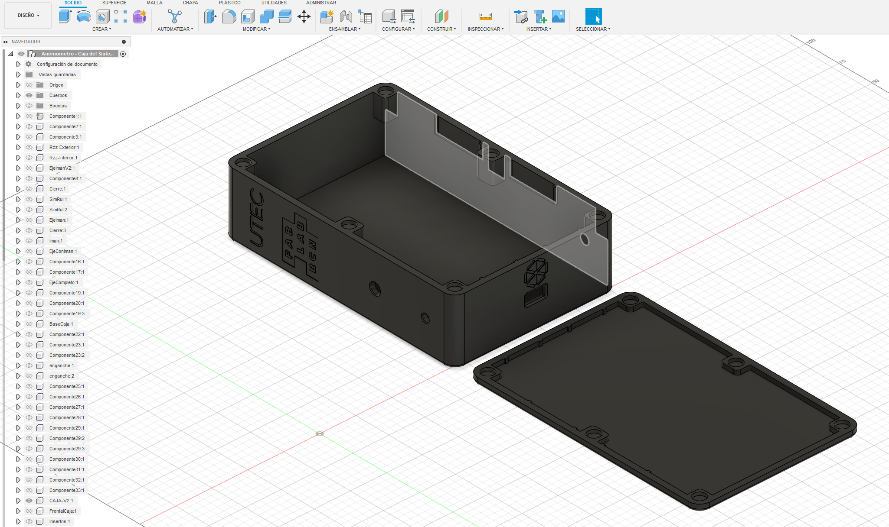
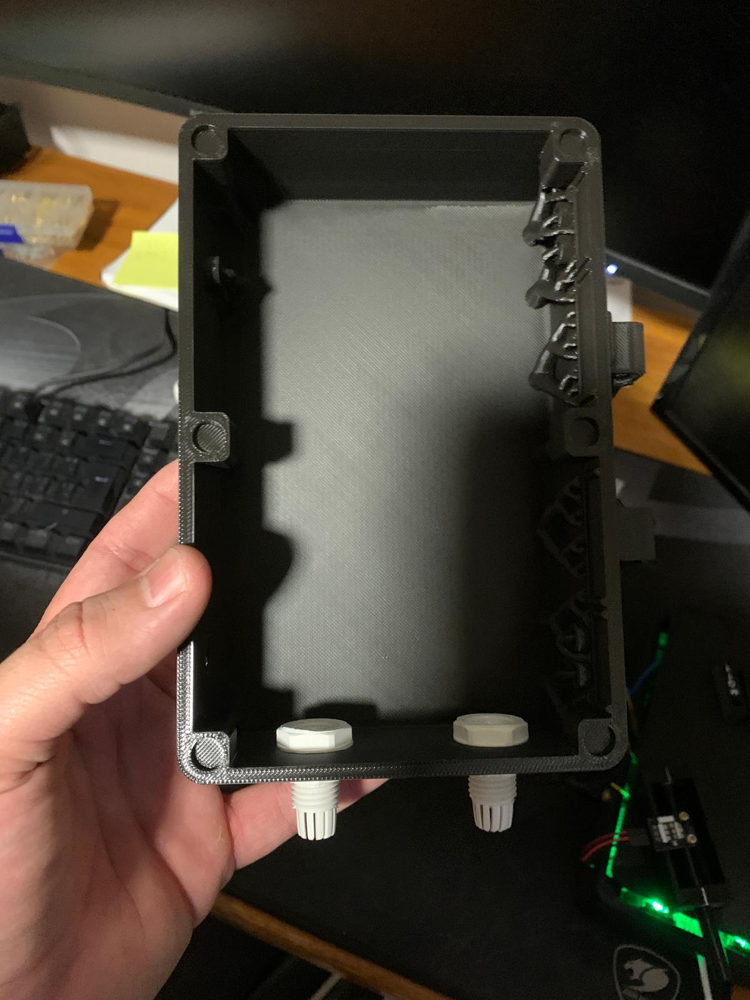

---
hide:
    - toc
---

# Proyecto Final: WHTMet - Estación Meteorológica IoT

Mi proyecto final para la Especialización en Fabricación Digital e Innovación se centra en el diseño y desarrollo de un sistema modular y sostenible para el monitoreo en tiempo real de variables climáticas clave, como temperatura, humedad y velocidad del viento, en plantaciones de eucalipto y otras áreas de producción rural.

El proyecto combina el uso de sensores, visualización interactiva y procesamiento de datos abiertos, con el objetivo de optimizar recursos y facilitar la toma de decisiones basadas en información precisa y actualizada. Este enfoque busca justamente fomentar prácticas agrícolas sostenibles al proporcionar herramientas tecnológicas accesibles y escalables para espacios rurales.

Un aspecto a destacar de este sistema es su cierta capacidad para introducir a los productores rurales y gestores forestales al mundo del Internet de las Cosas (IoT). Al ofrecer datos en tiempo real, se facilita la toma de decisiones informadas, permitiendo a los usuarios ajustar sus prácticas de manejo agrícola y forestal de manera eficiente, sostenible y sobre todo, informada.

Además, el proyecto plantea un fuerte énfasis en la sostenibilidad ambiental mediante el uso de materiales reciclados y sostenibles en su fabricación de cara al producto final. Este enfoque no solo responde a las premisas fundamentales de la EFDI, sino que también refleja mi compromiso personal con la innovación responsable y el diseño sostenible.

En los siguientes apartados, se irán desarrollando cada una de las etapas del desarrollo de este proyecto, desde la concepción inicial de la idea hasta la creación del prototipo final. Asimismo, intentaré abordar las evaluaciones previstas para medir el impacto del proyecto tanto en su público objetivo como en el entorno ambiental.

# Motivación y Objetivo del Proyecto

En el ámbito rural, la disponibilidad de datos meteorológicos precisos resulta fundamental para tomar decisiones informadas, especialmente en actividades agrícolas donde las condiciones climáticas afectan directamente la productividad y sostenibilidad de las plantaciones. A pesar de esto, muchas comunidades rurales o de gestores de plantaciones de eucalipto enfrentan barreras significativas, como el acceso limitado a estaciones meteorológicas asequibles y adaptadas a sus necesidades específicas.

Frente a esta realidad, decidí desarrollar WHTMet, un sistema diseñado para integrar tecnologías de fabricación digital y componentes sencillos, ofreciendo una herramienta accesible, económica y de bajo impacto ambiental. El objetivo principal de WHTMet es facilitar el monitoreo de parámetros clave como temperatura, humedad,y velocidad del viento (todos estos en principio, la idea a futuro es desarrollar aún más), permitiendo a las comunidades rurales y gestores de plantaciones de eucalipto contar con información en tiempo real para optimizar sus prácticas agrícolas y forestales.

Más allá de proporcionar datos, WHTMet busca promover la autosuficiencia tecnológica al alentar a estas comunidades a adoptar herramientas innovadoras y accesibles. De este modo, se pretende de a poco ir hacia el cierre de la brecha tecnológica que a menudo limita la capacidad para implementar soluciones avanzadas que potencien su desarrollo sostenible.

En las etapas iniciales del proyecto, tuve la fortuna de recibir apoyo y orientación de Bruno Rape, un ex compañero de la secundaria con quien me reencontré casualmente en la ciudad. Durante nuestra conversación, nos pusimos al día sobre nuestras vidas y compartimos detalles de en qué estábamos trabajando y estudiando. Fue en ese intercambio que surgió la idea de WHTMet, un sistema que respondiera a una necesidad real en su ámbito laboral.

Bruno trabaja en la gestión de plantaciones de eucalipto, un sector que enfrenta desafíos considerables debido a la falta de tecnología accesible y adecuada para recolectar y analizar datos de manera eficiente. Me contó que, actualmente, la toma de datos en estas plantaciones se realiza de forma manual, lo que no solo es un proceso lento y laborioso, sino también costoso, especialmente considerando que muchas de estas plantaciones están ubicadas en lugares remotos y de difícil acceso. Estas condiciones incrementan de manera considerable los costos de operación y limitan la capacidad de las empresas para tomar decisiones informadas y a tiempo.

Su experiencia y las dificultades que enfrentaba despertaron en mí un profundo interés por buscar una solución innovadora. La combinación de mi interés en tecnología y fabricación digital, junto con las necesidades que Bruno me comentó, se convirtió en el motor del proyecto. WHTMet no solo busca optimizar los costos y mejorar la eficiencia en la gestión de plantaciones, sino que también pretende ofrecer una herramienta práctica, sostenible y tecnológicamente avanzada para abordar un problema crítico en el sector agrícola y forestal. Este encuentro fortuito y el entendimiento de una problemática real le dieron un propósito claro al proyecto, motivándome a integrar conocimiento, diseño y sostenibilidad para crear una solución que marque una diferencia tangible.

# Problemática

La gestión eficiente de plantaciones de eucalipto enfrenta un desafío significativo debido a la ausencia de sistemas asequibles y/o personalizados que permitan monitorear variables climáticas clave, como la temperatura, la humedad y el viento. Estas variables son críticas para tomar decisiones relacionadas con el riego, la fertilización y el cuidado forestal. Sin embargo, los métodos actuales de monitoreo son rudimentarios, basados en la extracción manual de datos. Este enfoque no solo limita la precisión y la frecuencia de las mediciones, sino que también incrementa los costos operativos, especialmente en plantaciones ubicadas en áreas remotas y de difícil acceso. Esta combinación de tecnologías obsoletas y procesos ineficientes resulta en decisiones subóptimas que afectan tanto la productividad como la sostenibilidad de estas operaciones forestales.

# Problemas Recurrentes

## Herramientas rudimentarias y limitadas en alcance: 

Los métodos tradicionales carecen de capacidad para medir y registrar variables climáticas de manera continua y en tiempo real, lo que genera brechas en los datos y dificulta la planificación estratégica.

## Falta de integración con sistemas abiertos:

Los sistemas existentes no ofrecen opciones para interoperar con plataformas modernas de análisis o visualización de datos, lo que impide aprovechar tecnologías avanzadas como la inteligencia artificial o el aprendizaje automático para optimizar los procesos.

## Accesibilidad tecnológica:

Las soluciones disponibles en el mercado suelen ser costosas, lo que las hace inviables para pequeños y medianos productores rurales, limitando su adopción a gran escala.

# Comunidad y Contexto

El problema afecta directamente a productores rurales y gestores forestales que necesitan acceso a datos climáticos precisos y en tiempo real para tomar decisiones informadas que optimicen recursos. Estas comunidades trabajan, en muchos casos, en regiones aisladas donde las tecnologías modernas de monitoreo meteorológico son inaccesibles debido a su costo o complejidad. La implementación de sistemas asequibles y personalizados no solo atendería sus necesidades inmediatas, sino que también fomentaría un enfoque más eficiente y sostenible en la gestión forestal.

# Aspectos sociales, económicos y ambientales

## Social:

Proveer acceso a datos climáticos relevantes representa una herramienta clave para empoderar a productores rurales y gestores forestales. Esto les permitirá reducir la incertidumbre y mejorar sus prácticas de manejo forestal, fomentando un desarrollo local basado en la tecnología.

## Económicos:

Al basarse en tecnologías de código abierto y hardware reutilizable, el proyecto ofrece una solución económica y accesible. Este enfoque permite a pequeños y medianos productores adoptar herramientas avanzadas sin incurrir en altos costos iniciales. Además, el diseño escalable asegura que el sistema pueda adaptarse a plantaciones de diversos tamaños, aumentando su versatilidad y utilidad.

## Ambientales:

La monitorización eficiente de variables climáticas apoya prácticas sostenibles al optimizar el uso de recursos como el agua y los fertilizantes. Esto reduce el impacto ambiental de las operaciones forestales y fomenta un manejo responsable de los ecosistemas en los que se desarrollan las plantaciones de eucalipto.

# Investigación y Revisión de Soluciones Similares

Durante la fase inicial de investigación, realicé un análisis detallado de proyectos y dispositivos existentes, incluyendo tanto soluciones DIY (hagalo usted mismo) como productos comerciales. Entre los sistemas relevados me encontre con estaciones meteorológicas basadas en plataformas como Arduino y Raspberry Pi, ampliamente utilizadas en proyectos educativos y de prototipado, así como dispositivos comerciales como WeatherFlow y Netatmo Weather Station. Estos últimos ofrecen funcionalidades avanzadas y un diseño más  sofisticado, pero suelen estar dirigidos a usuarios con acceso a infraestructura tecnológica bastante desarrollada y recursos económicos significativos.

Identifiqué varias limitaciones en estas soluciones para su aplicación en contextos rurales. Por un lado, las estaciones DIY, aunque accesibles en términos de diseño, pueden ser complejas de ensamblar y operar para usuarios sin conocimientos técnicos previos y considerando que el publico objetivo no tiene un equipo especializado para esto, el foco debe estar en la sencillez a la hora de diseñar y planificar el ensamblaje del producto. Por otro lado, las opciones comerciales son significativamente más costosas, lo que las hace inalcanzables para comunidades rurales o gestores de plantaciones de eucalipto que no tengan los recursos a mano. Además, muchas empresas no están dispuestas a implementar sus sistemas en áreas rurales debido a los costos asociados, lo que incrementa exponencialmente la dificultad de acceso a estas tecnologías.

Este análisis me plantea una clara oportunidad para desarrollar un sistema funcional, accesible y optimizado, diseñado específicamente para las condiciones y necesidades de los entornos rurales, enfoncandome en la plantación de eucalipto (motivado por la ayuda y contexto brindados por Bruno). El sistema propuesto busca superar las barreras económicas e intenta que las técnicas se minimicen, al mismo tiempo que promueve un enfoque sostenible. Algunas características clave que veo identificadas para incluir en el diseño son:

- Uso de energía renovable (deseable a futuro): La incorporación de sistemas de bajo costo, como paneles solares y baterías asequibles, permitiría operar el dispositivo en zonas con acceso limitado o inexistente a la red eléctrica.

- Materiales reciclados y sostenibles (ABS Reciclado/Reciclable para el producto final): El uso de componentes reciclados no solo reduce costos, sino que también minimiza el impacto ambiental y fomenta prácticas de economía circular.

- Diseño modular: La modularidad facilita el mantenimiento y la replicabilidad del sistema, permitiendo que sea escalable y adaptable a diferentes escenarios y necesidades.

- Interfaz web accesible: Desarrollar una interfaz sencilla y accesible, compatible con smartphones y computadoras, que permita visualizar los datos en tiempo real y recibir alertas automáticas sobre condiciones climáticas críticas. Esto facilita el acceso a la información sin necesidad de equipos costosos o complejos.

- Interfaz sencilla: Asegurar que la interfaz sea fácil de usar, incluso para personas con poca experiencia tecnológica, y ofrecerla en múltiples idiomas locales para garantizar su accesibilidad en diversas comunidades (deseable a futuro el multilenguaje).

- Plataforma de datos abiertos: Desarrollar una plataforma de datos abiertos donde los usuarios puedan compartir sus datos con otros productores o investigadores. Esto fomenta la colaboración y el uso compartido de información climática para mejorar la toma de decisiones a nivel comunitario.

- Selección de sensores económicos pero precisos: Elegir sensores meteorológicos asequibles pero confiables, como los sensores de temperatura, humedad y velocidad del viento, que puedan ser fácilmente calibrados y reemplazados.

- Integración con sensores adicionales: Considerar la posibilidad de integrar sensores de calidad del aire, radiación solar o humedad del suelo, lo que ampliaría las aplicaciones del sistema sin aumentar considerablemente los costos.

- Sistema escalable: Permitir que el sistema pueda ser fácilmente ampliado para monitorear más parámetros o conectar múltiples estaciones en una red, ofreciendo la posibilidad de cubrir grandes áreas de plantaciones o integrar datos de diversas fuentes para un análisis más completo.

- Reemplazo fácil de componentes: Diseñar el sistema de manera que los usuarios puedan reemplazar partes defectuosas sin necesidad de conocimientos técnicos avanzados, utilizando algún sistema de conectores estándar y componentes modulares.

- Carcasa resistente y protección ante condiciones adversas: Diseñar una caja protectora que sea resistente al agua, polvo y  altas  temperaturas, asegurando que el sistema funcione sin problemas en entornos rurales con condiciones climáticas variables.

- Compatibilidad con otras tecnologías abiertas: Asegurar que el sistema sea compatible con otros dispositivos y plataformas de código abierto, como plataformas de agricultura de precisión o redes de sensores, para que pueda integrarse fácilmente con otras soluciones tecnológicas de los usuarios.

- Capacitación continua: Ofrecer programas de formación y talleres para productores rurales, orientados a enseñarles a usar el sistema, interpretar los datos y tomar decisiones basadas en la información obtenida.

- Fomentar la colaboración entre productores: Crear una red de apoyo entre los usuarios del sistema, fomentando el intercambio de experiencias y conocimientos sobre el uso de la tecnología y las mejores prácticas agrícolas y forestales.

# Diseño y Prototipado

En la fase de diseño y prototipado de WHTMet, el enfoque estuvo centrado en crear una estructura física funcional y accesible, adaptada tanto a los requisitos técnicos del sistema como a las necesidades de los usuarios finales. El diseño de cada componente y circuito del sistema fue un proceso iterativo que comenzó con bocetos a mano, donde conceptualicé la disposición general y la interacción entre los diferentes elementos, tomando en cuenta tanto la facilidad de ensamblaje como la seguridad del kit. La idea era que los componentes fueran intuitivos y fáciles de manejar para usuarios con diferentes niveles de experiencia, como los productores rurales y gestores forestales.

Adjunto por aquí debajo los primeros bocetos y las ideas tomadas al inicio del proyecto:

<figure markdown="span">
  { width="800"}
</figure>

<figure markdown="span">
  { width="800"}
</figure>

Una vez que los bocetos iniciales estuvieron listos, pasé a trabajar en modelos 3D utilizando programas de CAD (particularmente Fusion 360), lo que permitió crear representaciones digitales más precisas y detalladas de cada pieza del sistema. Estos modelos no solo ayudaron a visualizar el producto final, sino que también facilitaron la verificación de las dimensiones y la integración de los componentes, garantizando que todo encajara correctamente y que no hubiera interferencias entre los circuitos y las estructuras físicas. Ya que a medida que realizaba los modelos, los iba imprimiendo para tenerlos fisicamente e ir prototipando:

<figure markdown="span">
  { width="800"}
</figure>

<figure markdown="span">
  { width="800"}
</figure>

<figure markdown="span">
  { width="800"}
</figure>

<figure markdown="span">
  { width="800"}
</figure>

<figure markdown="span">
  { width="800"}
</figure>

Como se observa, se pasó por 3 versiones distintas de la caja de circuitos.

<figure markdown="span">
  { width="800"}
</figure>

<figure markdown="span">
  { width="800"}
</figure>

<figure markdown="span">
  { width="800"}
</figure>

<figure markdown="span">
  { width="800"}
</figure>

El diseño de los circuitos fue clave en este proceso, ya que los dispositivos debían ser fáciles de ensamblar y operar. La elección de componentes como el ESP32, junto con sensores de bajo costo, permitió crear un sistema modular y escalable, que podría ser ensamblado sin complicaciones.

<figure markdown="span">
  { width="800"}
</figure>

<figure markdown="span">
  { width="800"}
</figure>

<figure markdown="span">
  { width="800"}
</figure>

<figure markdown="span">
  { width="800"}
</figure>

<figure markdown="span">
  { width="800"}
</figure>

<figure markdown="span">
  { width="800"}
</figure>

<figure markdown="span">
  { width="800"}
</figure>

<figure markdown="span">
  { width="800"}
</figure>

<figure markdown="span">
  { width="800"}
</figure>

<figure markdown="span">
  { width="800"}
</figure>

<figure markdown="span">
  { width="800"}
</figure>

<figure markdown="span">
  { width="800"}
</figure>

<figure markdown="span">
  { width="800"}
</figure>

<figure markdown="span">
  { width="800"}
</figure>

<figure markdown="span">
  { width="800"}
</figure>

<figure markdown="span">
  { width="800"}
</figure>

<figure markdown="span">
  { width="800"}
</figure>

El prototipado se realizó a través de la impresión 3D y la fabricación digital, permitiendo iterar rápidamente en los diseños, hacer ajustes en tiempo real y probar diferentes configuraciones antes de pasar a la fase de producción. Este enfoque que brinda justamente esa flexibilidad, garantizó que cada iteración del prototipo fuera más eficiente y funcional, acercándonos cada vez más a una solución que pudiera ser implementada y utilizada de manera práctica y económica por los productores y gestores forestales.

El diseño y prototipado de WHTMet no solo consideró los aspectos técnicos y funcionales del sistema, sino que también priorizó la capacidad de adaptación, permitiendo que fuera una herramienta útil y práctica.

## Selección de Componentes
Decidí incluir resistencias, LEDs, interruptores, motores pequeños y cables conectores. Estos componentes permiten armar circuitos de dificultad progresiva, brindando una introducción gradual y sin frustración. También incluí instrucciones claras sobre el uso y cuidado de cada componente para que los adolescentes pudieran usarlos de forma segura y responsable.

## Uso de Materiales Sostenibles
Para hacer el proyecto sostenible, opté por usar ABS reciclado proveniente de tablets y carretes de filamento desechados. Este material está pensado para ser utilizado a la hora de crear las carcasas y bases de los circuitos, brindando durabilidad y resistencia sin necesidad de utilizar materiales nuevos. La sostenibilidad fue un criterio importante durante todo el desarrollo, ya que, además de educar en electrónica, quería que este proyecto transmitiera valores de respeto y cuidado del ambiente.

# Fabricación y Ensamblaje

La fase de fabricación incluye el uso de herramientas de fabricación digital como la impresora 3D para crear las piezas del kit. Las bases de los circuitos y las carcasas de los componentes serán en principio impresas en 3D utilizando PLA para validar la idea, una vez validada, como anteriormente mencioné, el foco está en fabricarlos con ABS reciclado, lo que les da un toque distintivo y respalda el mensaje de sostenibilidad que, como mencionaba con antelación, quiero transmitir con el proyecto.

## Ensamblaje del Kit
Es importante que cada componente tenga instrucciones detalladas de ensamblaje, siendo estas diseñadas para que los adolescentes puedan seguirlas fácilmente. Las guías incluyen diagramas y fotos paso a paso, con el fin de que los usuarios puedan armar los circuitos de manera autónoma y sin necesidad de supervisión constante. Además, incluí advertencias de seguridad para que los adolescentes sean conscientes de los cuidados que deben tener al trabajar con componentes electrónicos.

# Pruebas y Evaluación del Kit

En esta etapa con la finalidad de evaluar la funcionalidad y efectividad del kit, realicé pruebas tanto en los circuitos individuales como en su funcionamiento integrado. Probé cada componente para asegurarme de que resistencias, LEDs y motores funcionaran como estaba previsto y fueran seguros para su manipulación por el publico objetivo. Tras esta verificación inicial, al no poder realizar la prueba con el docente José, debido a que se encuentra de licencia médica, invité a 4 primos que tienen entre 14 y 16 años, para que en base a una serie de pruebas del primer prototipo, me den feedback, sobre la facilidad de uso y comprensión de los circuitos.

El feedback fue positivo en general: los adolescentes que me ayudaron aquí no solo muestran un disfrute el proceso de ensamblar los circuitos, sino que también lograron comprender un poco mejor los conceptos básicos de la corriente continua y aplicarlos de una manera lúdica. En base a algiunos de los comentarios de chicos, estos, me permitieron ajustar algunos aspectos, como esclarecer ciertas instrucciones y mejorar la estabilidad de algunas conexiones.

# Impacto y Beneficios

## Impacto Educativo
En base a la pequeña prueba con conocidos que están dentro del público objetivo, considero que el kit demostró ser una herramienta educativa efectiva, ya que permitió a los chicos experimentar de primera mano cómo funciona la corriente continua y cómo los distintos componentes de un circuito interactúan entre sí. Además, esta experiencia práctica facilitó que comprendieran conceptos que suelen ser abstractos en un entorno de aula tradicional.
Obviamente es importante destacar que esta prueba piloto, si bien da datos positivos, no es una prueba de validación completa, esa prueba se realizará con José cuando el mismo se reintegre de su licencia médica, lo cual, al enfrentar la prueba a un aula completa, con una actividad coordinada por el docente y una posterior encuesta a los estudiantes, me permitirá validar aún más la viabilidad de este proyecto.

## Contribución a la Sostenibilidad
La elección de materiales reciclados para la fabricación del kit tiene un impacto positivo no solo en términos ambientales, sino también en la percepción de los adolescentes. En la prueba realizada, al dialogar con los chicos sobre la idea de que el kit fuera realizado con el filamento de Kenistech u algún otro filamento que sea reciclado, luego de una larga charla sobre proceso de reciclado, intercambio de opiniones sobre el tema y consientización, ellos mencionaron que la idea está buenisima, ya que se le da un nuevo uso a algo que terminaría sin reciclar.

# Concluciones y Reflexiones Finales

Este proyecto me permitió fusionar mis conocimientos de electrónica  y fabricación digital con mi interés/foco en la educación y la sostenibilidad. Crear este kit de circuitos fue un desafío enriqucedor desde mi punto de vista, en el trayecto del mismo tuve que superar problemas técnicos que fueron surgiendo, entre ellos uno de los más dificiles: que el proyecto tenga al menos una buena funcionalidad y que sea atrayente para un público joven.

Estoy especialmente agradecido por el apoyo del docente José González, quien en ciertos momentos me apoyo en los aspectos teóricos y conceptuales de la electrónica y me brindó una perspectiva desde el área de la física que enriqueció significativamente el proyecto. Su feedback fue esencial para asegurarme de que el kit cumpliera con su propósito educativo de manera clara.

# Anexos

Diagramas de los circuitos para facilitar la replicación y enseñanza.

Especificaciones técnicas de cada componente.

Un manual de instrucciones detallado y advertencias de seguridad para el usuario.