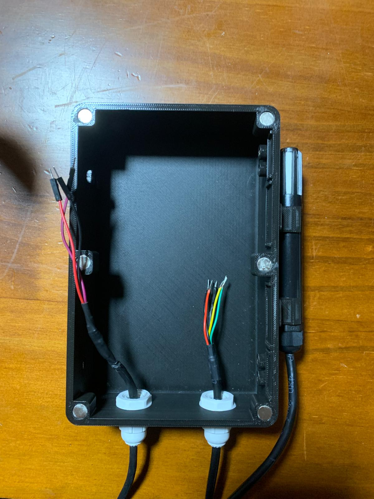

---
hide:
    - toc
---

# Proyecto Final: WHTMet - Estación Meteorológica IoT

# Armado del Prototipo

En esta sección detallaré los pasos a seguir para armar un Nodo de WHTMet.

1. Armado de los LEDs (pilotos) tanto de MQTT como el de InfluxDB.

<figure markdown="span">
  { width="800"}
</figure>

<figure markdown="span">
  { width="800"}
</figure>

<figure markdown="span">
  { width="800"}
</figure>

<figure markdown="span">
  { width="800"}
</figure>

<figure markdown="span">
  { width="800"}
</figure>

<figure markdown="span">
  { width="800"}
</figure>

<figure markdown="span">
  { width="800"}
</figure>

2. Colocación de los conectores PG7 en la caja.

<figure markdown="span">
  { width="800"}
</figure>

<figure markdown="span">
  { width="800"}
</figure>

<figure markdown="span">
  { width="800"}
</figure>

<figure markdown="span">
  { width="800"}
</figure>

<figure markdown="span">
  { width="800"}
</figure>

<video width="600" controls>
  <source src="../../videos/armPG7.mp4" type="video/mp4">
</video>

3. Colocación de los insertos en la caja.

<figure markdown="span">
  { width="800"}
</figure>

<figure markdown="span">
  { width="800"}
</figure>

<video width="600" controls>
  <source src="../../videos/armInserts.mp4" type="video/mp4">
</video>

4. Colocación de los imanes en la caja.

<figure markdown="span">
  { width="800"}
</figure>

<figure markdown="span">
  { width="800"}
</figure>

<figure markdown="span">
  { width="800"}
</figure>

<figure markdown="span">
  { width="800"}
</figure>

<figure markdown="span">
  { width="800"}
</figure>

<video width="600" controls>
  <source src="../../videos/armImanes.mp4" type="video/mp4">
</video>

### Chequeo de Armado 1

Si seguimos correctamente los pasos anteriormente detallados, tendríamos algo similar a esto:

<figure markdown="span">
  { width="800"}
</figure>

<figure markdown="span">
  { width="800"}
</figure>

<figure markdown="span">
  { width="800"}
</figure>

5. Pasaje de cables por PG7 del Anemómetro.

<figure markdown="span">
  { width="800"}
</figure>

<figure markdown="span">
  { width="800"}
</figure>

<figure markdown="span">
  { width="800"}
</figure>

<figure markdown="span">
  { width="800"}
</figure>

<figure markdown="span">
  { width="800"}
</figure>

<video width="600" controls>
  <source src="../../videos/armCabAnem1.mp4" type="video/mp4">
</video>

<video width="600" controls>
  <source src="../../videos/armCabAnem2.mp4" type="video/mp4">
</video>

<video width="600" controls>
  <source src="../../videos/armCabAnem3.mp4" type="video/mp4">
</video>

6. Pasaje de cables por PG7 del Sensor SHT31 y Colocación.

<figure markdown="span">
  { width="800"}
</figure>

<figure markdown="span">
  { width="800"}
</figure>

<figure markdown="span">
  { width="800"}
</figure>

<figure markdown="span">
  { width="800"}
</figure>

<figure markdown="span">
  { width="800"}
</figure>

<figure markdown="span">
  { width="800"}
</figure>

<figure markdown="span">
  { width="800"}
</figure>

<video width="600" controls>
  <source src="../../videos/armCabSHT31-1.mp4" type="video/mp4">
</video>

<video width="600" controls>
  <source src="../../videos/armCabSHT31-2.mp4" type="video/mp4">
</video>

<video width="600" controls>
  <source src="../../videos/armCabSHT31-3.mp4" type="video/mp4">
</video>

<video width="600" controls>
  <source src="../../videos/armCabSHT31-4.mp4" type="video/mp4">
</video>

7. Montaje de Protoboard y ESP32.

<figure markdown="span">
  { width="800"}
</figure>

<figure markdown="span">
  { width="800"}
</figure>

<video width="600" controls>
  <source src="../../videos/armAntenaESP32.mp4" type="video/mp4">
</video>

8. Montaje de Pilotos LEDS MQTT y WiFi.

<figure markdown="span">
  { width="800"}
</figure>
<figure markdown="span">
  { width="800"}
</figure>

<video width="600" controls>
  <source src="../../videos/armPil-1.mp4" type="video/mp4">
</video>

<video width="600" controls>
  <source src="../../videos/armPil-2.mp4" type="video/mp4">
</video>

### Chequeo de Armado 2

Si seguimos correctamente los pasos anteriormente detallados, tendríamos algo similar a esto:

<figure markdown="span">
  { width="800"}
</figure>

<video width="600" controls>
  <source src="../../videos/armPanorCA2.mp4" type="video/mp4">
</video>

<figure markdown="span">
  { width="400"}
</figure>