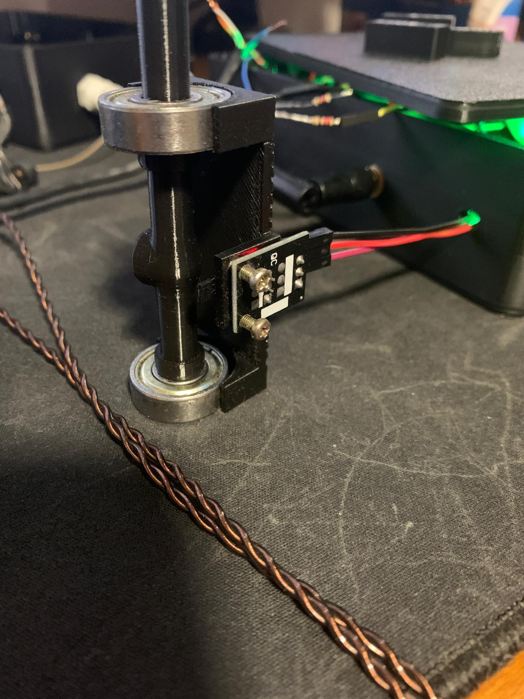

---
hide:
    - toc
---

# Proyecto Final: WHTMet - Estación Meteorológica IoT

# Diseño y Prototipado

En la fase de diseño y prototipado de WHTMet, el enfoque estuvo centrado en crear una estructura física funcional y accesible, adaptada tanto a los requisitos técnicos del sistema como a las necesidades de los usuarios finales. El diseño de cada componente y circuito del sistema fue un proceso iterativo que comenzó con bocetos a mano, donde conceptualicé la disposición general y la interacción entre los diferentes elementos, tomando en cuenta tanto la facilidad de ensamblaje como la seguridad del kit. La idea era que los componentes fueran intuitivos y fáciles de manejar para usuarios con diferentes niveles de experiencia, como los productores rurales y gestores forestales.

Adjunto por aquí debajo los primeros bocetos y las ideas tomadas al inicio del proyecto:

<figure markdown="span">
  { width="800"}
</figure>

<figure markdown="span">
  { width="800"}
</figure>

Una vez que los bocetos iniciales estuvieron listos, pasé a trabajar en modelos 3D utilizando programas de CAD (particularmente Fusion 360), lo que permitió crear representaciones digitales más precisas y detalladas de cada pieza del sistema. Estos modelos no solo ayudaron a visualizar el producto final, sino que también facilitaron la verificación de las dimensiones y la integración de los componentes, garantizando que todo encajara correctamente y que no hubiera interferencias entre los circuitos y las estructuras físicas. Ya que a medida que realizaba los modelos, los iba imprimiendo para tenerlos fisicamente e ir prototipando:

##  Diseño y Prototipado - Caja/Carcasa

<figure markdown="span">
  { width="800"}
</figure>

<figure markdown="span">
  { width="800"}
</figure>

<figure markdown="span">
  { width="800"}
</figure>

<figure markdown="span">
  { width="800"}
</figure>

<figure markdown="span">
  { width="800"}
</figure>

Como se observa, se pasó por 3 versiones distintas de la caja de circuitos.

<figure markdown="span">
  { width="800"}
</figure>

<figure markdown="span">
  { width="800"}
</figure>

<figure markdown="span">
  { width="800"}
</figure>

<figure markdown="span">
  { width="800"}
</figure>

El diseño de los circuitos fue clave en este proceso, ya que los dispositivos debían ser fáciles de ensamblar y operar. La elección de componentes como el ESP32, junto con sensores de bajo costo, permitió crear un sistema modular y escalable, que podría ser ensamblado sin complicaciones.

##  Diseño y Prototipado - Circuitos

<figure markdown="span">
  { width="800"}
</figure>

<figure markdown="span">
  { width="800"}
</figure>

<figure markdown="span">
  { width="800"}
</figure>

<figure markdown="span">
  { width="800"}
</figure>

<figure markdown="span">
  { width="800"}
</figure>

<figure markdown="span">
  { width="800"}
</figure>

<figure markdown="span">
  { width="800"}
</figure>

<figure markdown="span">
  { width="800"}
</figure>

<figure markdown="span">
  { width="800"}
</figure>

<figure markdown="span">
  { width="800"}
</figure>

<figure markdown="span">
  { width="800"}
</figure>

<figure markdown="span">
  { width="800"}
</figure>

<figure markdown="span">
  { width="800"}
</figure>

<figure markdown="span">
  { width="800"}
</figure>

<figure markdown="span">
  { width="800"}
</figure>

<figure markdown="span">
  { width="800"}
</figure>

<figure markdown="span">
  { width="800"}
</figure>

##  Diseño y Prototipado - Anemómetro

<figure markdown="span">
  { width="800"}
</figure>

<figure markdown="span">
  { width="800"}
</figure>

<figure markdown="span">
  { width="800"}
</figure>

<figure markdown="span">
  { width="800"}
</figure>

<figure markdown="span">
  { width="800"}
</figure>

<figure markdown="span">
  { width="800"}
</figure>

<figure markdown="span">
  { width="800"}
</figure>

<figure markdown="span">
  { width="800"}
</figure>

<figure markdown="span">
  { width="800"}
</figure>

<figure markdown="span">
  { width="800"}
</figure>

<figure markdown="span">
  { width="800"}
</figure>

El prototipado de los distintos componentes se realizó a través de la impresión 3D y la fabricación digital, permitiendo iterar rápidamente en los diseños, hacer ajustes en tiempo real y probar diferentes configuraciones antes de pasar a la fase de producción. Este enfoque que brinda justamente esa flexibilidad, garantizó que cada iteración del prototipo fuera más eficiente y funcional, acercándonos cada vez más a una solución que pudiera ser implementada y utilizada de manera práctica y económica por los productores y gestores forestales.

El diseño y prototipado de WHTMet no solo consideró los aspectos técnicos y funcionales del sistema, sino que también priorizó la capacidad de adaptación, permitiendo que fuera una herramienta útil y práctica.

## Prototipo

El prototipo de WHTMet integra una serie de tecnologías y componentes que permiten un monitoreo climático efectivo en plantaciones de eucalipto. A continuación se detallan los sensores, el sistema de gestión de datos, y el diseño e integración que conforman el prototipo.
Sensores

El prototipo utiliza varios sensores específicos para medir las variables climáticas en tiempo real:

- Sensor SHT31 (IP68): Este sensor se utiliza para medir la temperatura y humedad ambiental. Con su clasificación IP68, es adecuado para soportar condiciones exteriores y protegidas contra el polvo y la humedad, lo que lo hace ideal para plantaciones en entornos rurales. Su alta precisión asegura mediciones confiables para la gestión de recursos en las plantaciones.

- Sensor DHT11: Este sensor se encarga de medir la temperatura y humedad dentro de la caja de circuitos. Al ser un sensor más económico y de menor precisión en comparación con el SHT31, se utiliza para garantizar el funcionamiento óptimo del sistema dentro de un entorno controlado, como la caja que alberga los circuitos y la electrónica.

- Sensor Hall (Anemómetro): Este sensor se utiliza para medir la velocidad del viento, lo cual es crucial para entender cómo las condiciones climáticas afectan las plantaciones, especialmente en áreas con fuertes vientos que pueden impactar el crecimiento de los cultivos. El diseño del anemómetro aún está en proceso de adaptación para mejorar su precisión y robustez en condiciones de exterior.

## Sistema de Gestión de Datos

El prototipo hace uso de varias tecnologías de software y bases de datos para procesar, almacenar y visualizar los datos en tiempo real:

- Proxmox: La plataforma de virtualización Proxmox se utiliza para gestionar de manera centralizada el servidor y las máquinas virtuales. Esta infraestructura virtualizada permite manejar eficientemente los recursos y el procesamiento de datos provenientes de los sensores distribuidos en las plantaciones.

- Node-RED: La plataforma de Node-RED se encarga de gestionar los flujos de datos desde los sensores. A través de un diseño visual y fácil de integrar, los datos recolectados por los sensores son procesados y enviados a la base de datos en tiempo real. Además, Node-RED facilita la creación de flujos automatizados, como alertas o acciones específicas basadas en los valores medidos.

- Mosquitto MQTT: Se emplea Mosquitto MQTT como protocolo de mensajería para transmitir datos de manera eficiente entre los sensores y el sistema central. MQTT es especialmente útil en entornos de baja ancho de banda o donde se requieren actualizaciones frecuentes y en tiempo real.

- InfluxDB: InfluxDB, una base de datos especializada en time series (TSDB), es utilizada para almacenar las mediciones de los sensores a lo largo del tiempo. Esta base de datos permite una gestión eficiente de grandes volúmenes de datos temporales, asegurando un acceso rápido y preciso para su análisis posterior.

- PostgreSQL: Los datos que requieren un almacenamiento estructurado, como las coordenadas geográficas de los sensores y las configuraciones del sistema, se migran de InfluxDB a PostgreSQL. Esta base de datos relacional permite manejar de manera eficiente la información relacionada con la administración y personalización del sistema.

## Interfaz de Usuario

La interfaz de usuario se ha diseñado para proporcionar una experiencia intuitiva a los usuarios del sistema. En su estado actual, la interfaz incluye un mapa interactivo que se alimenta a través de la API de Google Maps, mostrando la ubicación georreferenciada de los nodos de sensores. Aunque por el momento solo hay un nodo activo, el diseño de la interfaz permite la fácil expansión del sistema para incluir más nodos a medida que se incorporen más puntos de monitoreo en la plantación.
Diseño e Integración

El diseño físico del prototipo ha sido cuidadosamente planificado para garantizar que los sensores y la electrónica puedan operar eficientemente en condiciones exteriores y rurales:

- Diseño 2D/3D: Se ha diseñado una caja y tapa protectora personalizada para los sensores y la electrónica, con un enfoque en la resistencia a condiciones adversas. Este diseño asegura que los componentes del sistema estén protegidos de factores como la lluvia, el polvo y las temperaturas extremas, comunes en las plantaciones de eucalipto.

- Adaptación del Diseño del Anemómetro: El diseño del anemómetro está en proceso de adaptación para optimizar su rendimiento en entornos exteriores. Esta fase incluye la mejora de la precisión y la durabilidad del sensor frente a condiciones de viento extremas.

- Procesos Aditivos/Sustractivos: Para la creación de los prototipos, se ha utilizado la impresión 3D en PLA (para las primeras pruebas) y ABS (para el producto final), materiales adecuados para crear cajas resistentes y duraderas. La impresión 3D ha permitido una personalización rápida del diseño y la fabricación de piezas de manera eficiente.

## Electrónica y Programación

El prototipo utiliza el ESP32, un microcontrolador eficiente que permite la conexión de los sensores al sistema de gestión central. La programación se realiza mediante el Arduino IDE, y los flujos automatizados en Node-RED facilitan la integración de todos los componentes. A través de MQTT Mosquitto, los datos se envían de manera eficiente a las bases de datos, y InfluxDB y PostgreSQL permiten almacenar y gestionar los datos a largo plazo. Además, los procesos de migración de datos de InfluxDB a PostgreSQL se gestionan mediante tareas automatizadas, asegurando la coherencia y accesibilidad de la información.