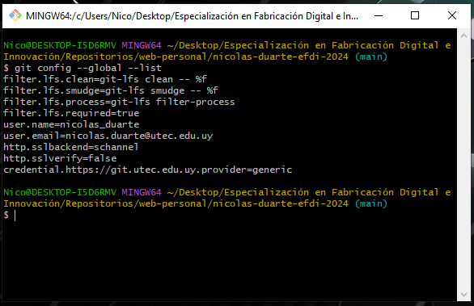
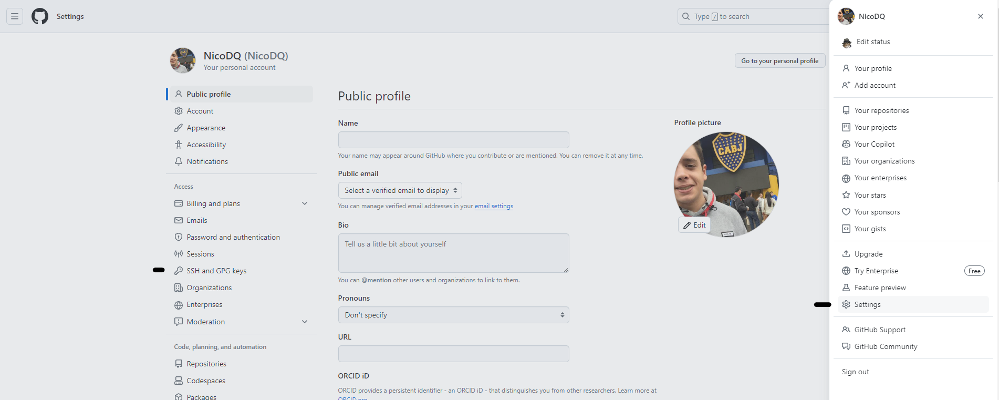
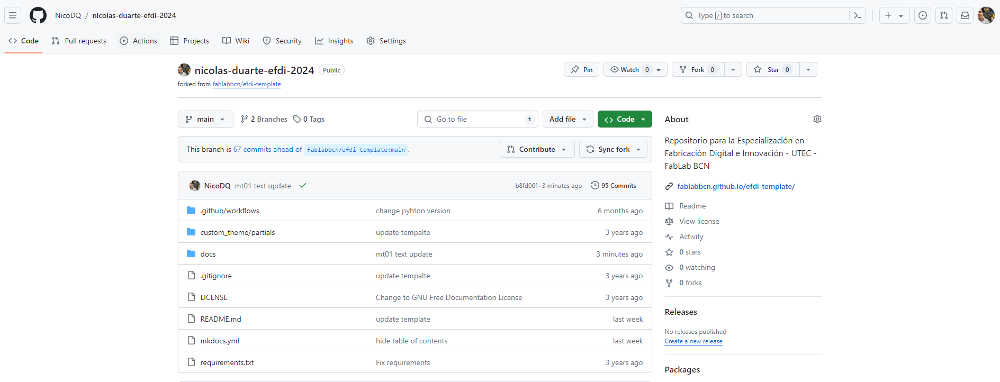
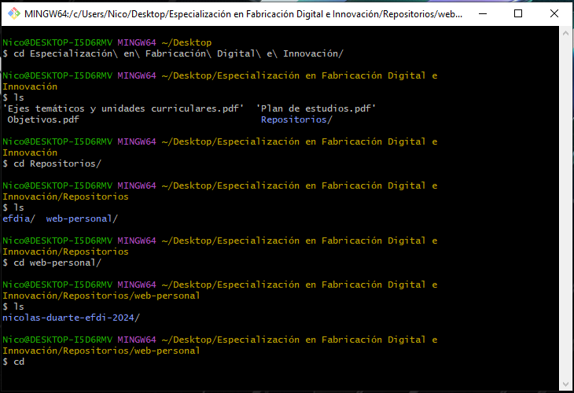

# MT01 - Introducción a Herramientas Digitales

El módulo de Introducción a Herramientas Digitales es fundamental para familiarizarse con herramientas esenciales en el ámbito de la informática proporcionando las habilidades necesarias para trabajar de manera eficiente en entornos de desarrollo de webs, gestionar proyectos con Git y colaborar con otros  utilizando GitHub, además de crear documentación legible con Markdown y MkDocs. 

Para ello vimos diferentes herramientas como lo son: 

## Git

{ align=left }

Git es un sistema de control de versiones distribuido ampliamente utilizado. Permite a los desarrolladores realizar un seguimiento de los cambios en el código fuente durante el tiempo, coordinar el trabajo entre múltiples personas, revertir a versiones anteriores del código y mucho más. En este módulo, los estudiantes generalmente aprenden conceptos básicos como inicializar un repositorio, realizar confirmaciones (commits), crear y fusionar ramas, resolver conflictos y colaborar en proyectos con otros desarrolladores.

## GitHub

{ align=right }

GitHub es una plataforma de alojamiento de código basada en la web que utiliza Git para el control de versiones. Permite a los desarrolladores alojar repositorios Git, colaborar con otros, realizar seguimientos de problemas (issues) y realizar solicitudes de extracción (pull requests), entre otras funciones. En este módulo, los estudiantes aprenden a crear y clonar repositorios, colaborar en proyectos, realizar seguimiento de problemas y contribuir a proyectos de código abierto. Dentro de GitHub utilizamos también una tecnología llamada GitHub Pages.

## GitHub Pages

{ align=left }

GitHub Pages es un servicio que ofrece GitHub que permite a los usuarios alojar sitios web directamente desde sus repositorios de GitHub. Esencialmente, te permite convertir tu repositorio de GitHub en un sitio web público accesible a través de un dominio proporcionado por GitHub o un dominio personalizado en caso que lo tengas.

## Markdown 

{ align=right }

Markdown es un lenguaje de marcado ligero que se utiliza comúnmente para formatear texto de manera simple y rápida. Permite agregar formato básico, como encabezados, listas, enlaces e imágenes, utilizando una sintaxis sencilla y fácil de leer. MkDocs es una herramienta que permite generar sitios web estáticos a partir de archivos Markdown, lo que facilita la creación de documentación legible y bien formateada para proyectos de software. En este módulo, los estudiantes aprenden a escribir y formatear texto utilizando Markdown, así como a generar documentación con MkDocs.

## Proceso Realizado

Primero se solicitaba crear una cuenta en GitHub, en mi caso ya la tenía desde hace mucho tiempo:

<figure markdown="span">
  { width="300"}
</figure>

Luego necesitaba instalar git en mi computadora, que, otra vez, ya lo tenía instalado:

<figure markdown="span">
  { width="300"}
</figure>

Lo que sí realicé es la configuración del nombre de manera correcta, ya que los que estaba utilizando nicolas.duarte y para la especialización lo cambié por nicolas_duarte.
Para ello ejecuté el comando *git config --global user.name "nicolas_duarte"* para asignar dicho nuevo valor y luego *git config --global --list* para verificar el cambio realizado:

<figure markdown="span">
  { width="300"}
</figure>

Posteriormente realicé la generación de una ssh key nueva para establecer una conexión segura entre mi computadora y GitHub, para ello ejecuté *ssh-keygen -t rsa -C "nicolas.duarte@utec.edu.uy"*
Para chequear que la key está generada ejecuté *cat ~/.ssh/id_rsa.pub*

<figure markdown="span">
  { width="300"}
</figure>

Luego de generar la key la copié ejecutando (para Windows) *clip <~/.ssh/id_rsa.pub*

<figure markdown="span">
  { width="300"}
</figure>

Luego la copié en mi cuenta de GitHub primero yendo a *Settings* dentro de mi perfil y luego a *SSH and GPT Keys*

<figure markdown="span">
  { width="300"}
</figure>

Fuí a *New SSH key* y luego cuando se despliega el menu para agragarla la pegué dandole un nombre en el espacio correspondiente:

<figure markdown="span">
  { width="300"}
</figure>

Luego cuando todo está completado *Add SSH key*

<figure markdown="span">
  { width="300"}
</figure>

Resultando (en mi caso) lo siguiente:

<figure markdown="span">
  { width="300"}
</figure>

Ahora con todo configurado, necesitaba realizar un fork del proyecto *efdi-template* del repositorio *https://github.com/fablabbcn/efdi-template* para ello, fui al repositorio y en la opcion fork *Create new fork*

<figure markdown="span">
  { width="300"}
</figure>

Una vez realizado el fork, tengo un repositorio remoto con un template del sitio web listo para editar, resultando:

<figure markdown="span">
  { width="300"}
</figure>

Luego cree una carpeta en mi computadora, donde cree el repositorio local al cual clone el proyecto ejecutando *git clone git@github.com:NicoDQ/nicolas-duarte-efdi-2024.git*
creándome así la carpeta *nicolas-duarte-efdi-2024* que es donde están todos los archivos correspondientes al repositorio.

<figure markdown="span">
  {:target="_blank"}{ width="300"}
</figure>

<figure markdown="span">
  {:target="_blank"}{ width="300"}
</figure>
