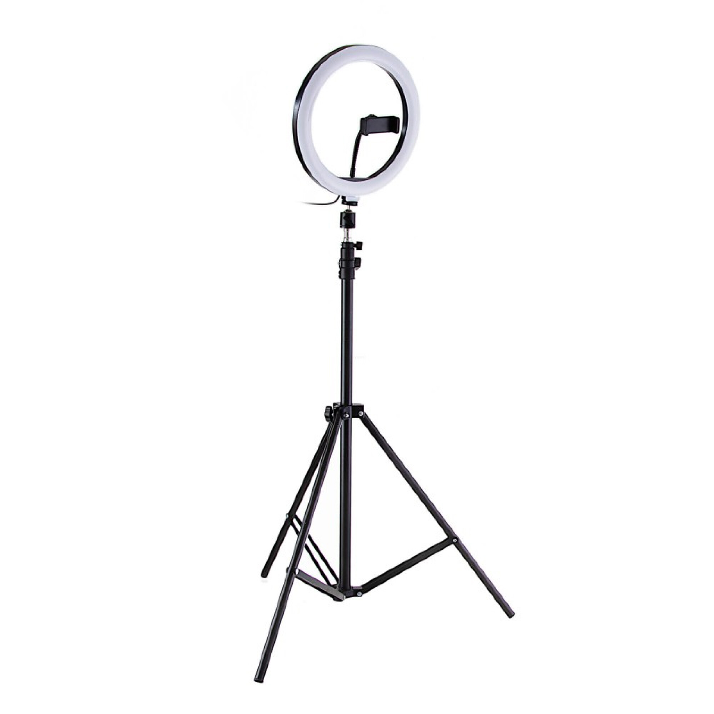
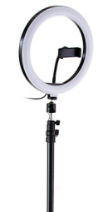
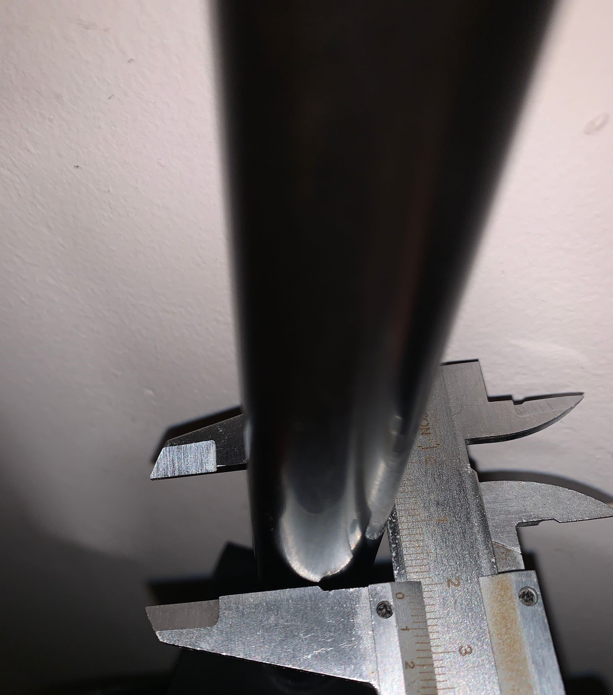
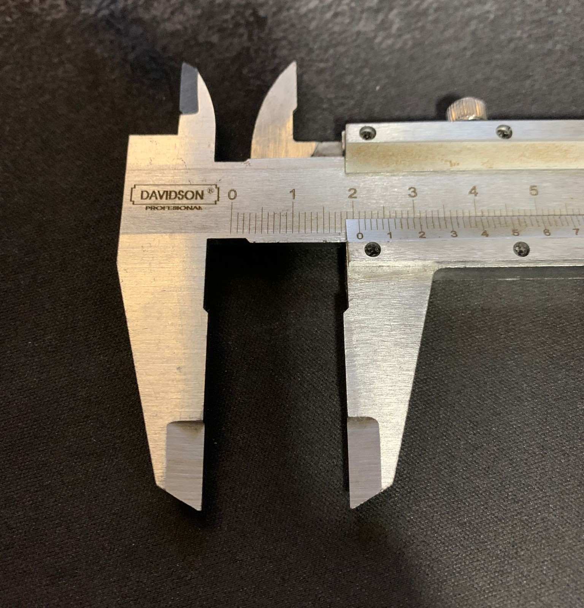

---
hide:
    - toc
---

# MT02 - Diseño 2D y Modelado 3D

El módulo de Diseño 2D y Modelado 3D es una  exploración de las dimensiones digitales que abarcan el arte, la ingeniería y la creatividad. Desde mi perspectiva, este curso es una emocionante travesía donde nos sumergimos en el mundo del diseño, aprendiendo a dar vida a nuestras ideas mediante herramientas digitales. Desde la simplicidad de los bocetos en dos dimensiones hasta la complejidad tridimensional de los modelos, este módulo nos desafía a pensar de manera innovadora y a desarrollar habilidades técnicas que nos permitan materializar nuestras visiones. Exploramos las bases del diseño gráfico y la manipulación de formas en 2D, así como también nos aventuramos en el mundo del modelado 3D, donde daremos forma a objetos y escenas con un nivel de detalle más que interesante. No solo adquirimos conocimientos técnicos, sino que también cultivamos nuestra capacidad para expresarnos visualmente y para enfrentar desafíos creativos con ingenio y determinación.

Para llevar a cabo vimos diferentes herramientas como lo son: 

## Tinkercad

{ align=left }

Tinkercad es una plataforma de diseño 3D en línea que permite a los usuarios crear modelos tridimensionales de manera intuitiva y accesible. Desarrollado por Autodesk, Tinkercad es especialmente popular entre estudiantes, aficionados al bricolaje, y diseñadores principiantes debido a su interfaz fácil de usar y su enfoque en la simplicidad.

Los usuarios pueden crear diseños 3D utilizando una variedad de formas básicas, herramientas de manipulación y funciones de edición. La plataforma también ofrece una biblioteca de formas predefinidas que los usuarios pueden arrastrar y soltar en su área de trabajo para construir modelos más complejos.

Además de su enfoque en el modelado 3D, Tinkercad también incluye herramientas para la creación de circuitos electrónicos y diseño de código. Esto lo convierte en una opción versátil para proyectos que van desde la impresión 3D hasta la electrónica y la programación básica.

## Fusion 360

{ align=left }

Fusion 360 es una potente plataforma de diseño asistido por computadora (CAD), modelado 3D, simulación y fabricación desarrollada por Autodesk. Es una herramienta integral que combina varias funciones esenciales para el diseño y la ingeniería en una sola aplicación.

Una de las características distintivas de Fusion 360 es su enfoque en el diseño colaborativo basado en la nube. Esto significa que múltiples usuarios pueden trabajar en un mismo proyecto simultáneamente desde diferentes ubicaciones, lo que facilita la colaboración en equipos distribuidos.

Fusion 360 ofrece una amplia gama de herramientas de modelado 3D, incluidas opciones para esculpir, crear superficies orgánicas y diseñar piezas mecánicas. También incluye capacidades de simulación para evaluar el rendimiento y la resistencia de los diseños antes de la fabricación.

Además, Fusion 360 integra herramientas de fabricación asistida por computadora (CAM), lo que permite a los usuarios generar trayectorias de herramientas para máquinas de control numérico por computadora (CNC) y llevar a cabo la fabricación de prototipos y productos finales.

## Proceso Realizado

Para la Actividad del MT02, se nos solicitaba realizar un ejercicio diseñado específicamente para poner en práctica varios de los conocimientos transmitidos y aplicar las principales herramientas y procesos de diseño presentadas, planteándonos el diseñar un objeto utilitario compuesto por al menos dos piezas y contar con un logo en relieve. Se generará una lámina de presentación muy simple que contenga un título, la imagen del modelo y una breve descripción.

Previo a la realización de la pieza con las características solicitadas, armé un logo identificativo, ya que esto se mencionó en la videoconferencia, para ello, fui a la herramienta: -------- y generé un logo mediante IA, para así luego poder vectorizarlo y a partir del vector generado, armar en fusion 360 mediante la funcion de extrusión, un objeto tridimensional de dicho logo:

Me propuse realizar una pieza funcional que supliera una faltante que tenia:
Al ser docente de UTEC, de una carrera como LTI, donde la gran mayoría de las clases y las reuniones que tengo por el trabajo de docencia se dan en un entorno de videoconferencias, el hecho de mejorar el entorno de trabajo es algo que me persegía ultimamente, por lo tanto, me compré un aro de luz led para fotografía, de manera de utilizarlo para mejorar la luz de la camara en mis encuentros de videoconferencia:

<figure markdown="span">
  { width="600"}
</figure>

El problema del aro de luz, es que el mismo tenía un trípode de apoyo, por lo tanto para tener un montaje "perfecto" en el escritorio, quedando por detrás de los monitores, debía modificar un poco el aro de luz y agregar un soporte para que este se afirme en el escritorio. Para ello, retiré la base del aro, dejandolo como un monopie, donde acoplare al mismo, la base que engancha en mi escritorio:

<figure markdown="span">
  { width="600"}
</figure>

En este momento tomé las medidas del diámetro del caño que sostiene el aro para tener una referencia de donde partir:

<figure markdown="span">
  { width="600"}
</figure>

<figure markdown="span">
  { width="600"}
</figure>

Luego tomé las medidas de la mesa donde el soporte iba a estar enganchado para también tener esa referencia de medida:

<figure markdown="span">
  { width="600"}
</figure>

Una vez con las medidas de referencia tomadas, me pase a Fusion 360 para comenzar con el sketch de donde partiré para crear el modelo 3d:

