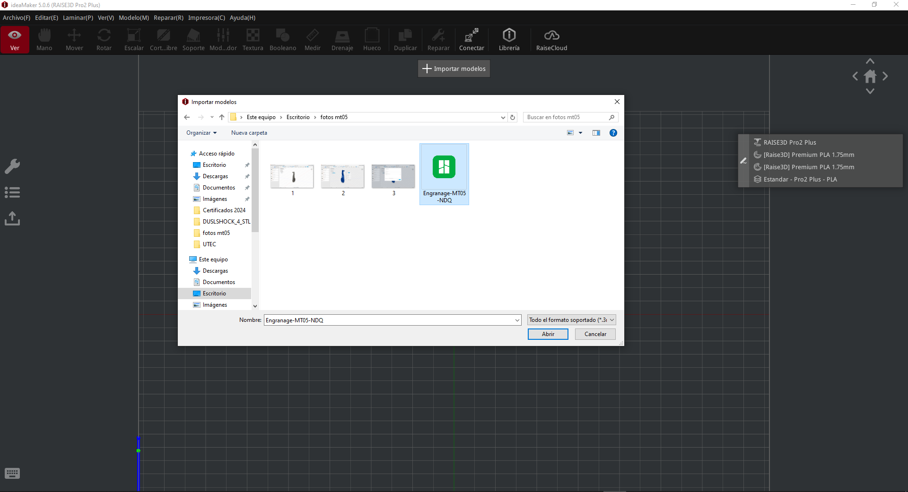
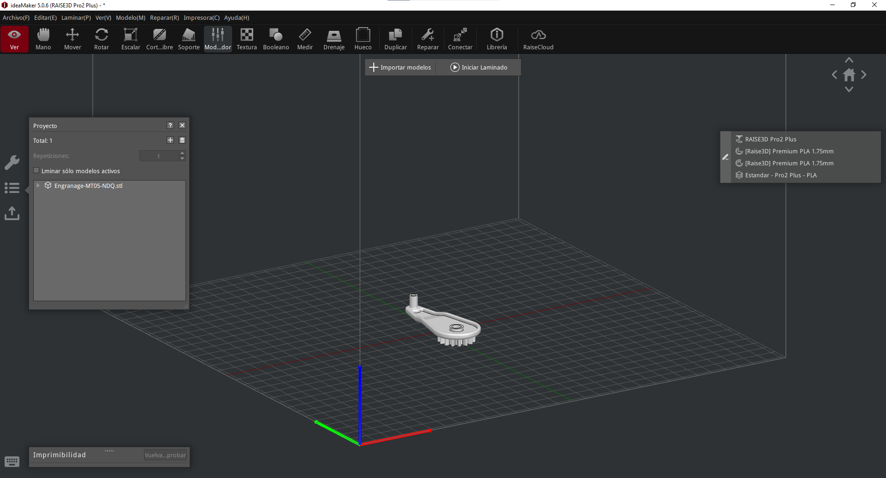
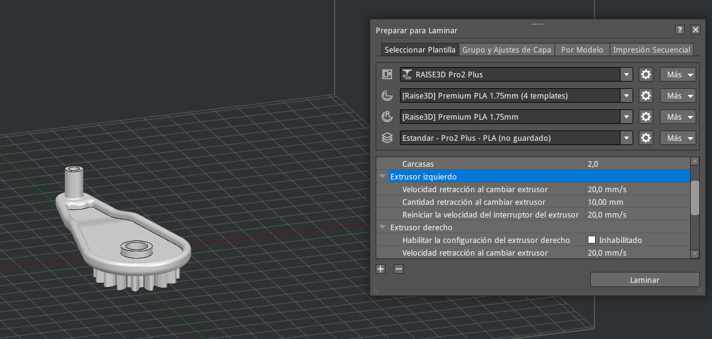
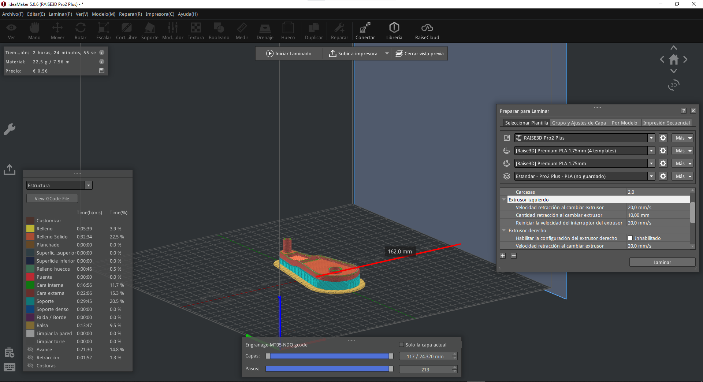

---
hide:
    - toc
---

# MT05 - Impresión y Escaneo 3D

## Introducción

El módulo de Impresión y Escaneo 3D es una parte fundamental del eje de tecnología y fabricación, que busca llevarnos más allá de la teoría y sumergirnos en la aplicación práctica de la tecnología, para esto, en este módulo, nos enfocaremos en el mundo de la impresión y el escaneo 3D, exploraramos en profundidad estas tecnologías innovadoras que están revolucionando la fabricación digital y la innovación.

La impresión 3D, nos permite transformar diseños digitales en objetos físicos tridimensionales mediante la adición de material capa por capa. Esta tecnología ha abierto un mundo de posibilidades en diversos campos como la ingeniería, la medicina, la arquitectura, y la moda, entre otros. Durante este módulo, aprendimos sobre los distintos tipos de impresoras 3D, materiales de impresión, software de diseño y procesos de fabricación. Nos entendimos en la práctica de crear y optimizar modelos 3D, preparandolos para la impresión y resolver problemas comunes que pueden surgir durante el proceso.

El escaneo 3D, por otro lado, nos permite capturar la geometría de objetos físicos y convertirla en modelos digitales precisos. Esta técnica es crucial para la ingeniería inversa, la digitalización de patrimonio cultural, y la personalización de productos.

A lo largo del módulo, trabajé en proyectos prácticos que me permitieron aplicar los conceptos aprendidos, resolver desafíos reales y desarrollar habilidades que son altamente valoradas en la industria de la fabricación digital.

Para llevar a cabo este módulo vimos diferentes herramientas como lo son: 

## Netfabb

{ align=left }

Netfabb es un software de Autodesk diseñado para la reparación, preparación y optimización de archivos de modelos 3D para impresión. Originalmente desarrollado por una empresa alemana llamada netfabb GmbH, fue adquirido por Autodesk en 2015. Netfabb se utiliza ampliamente en diversas industrias, incluidas la automotriz, aeroespacial, médica y de productos de consumo, debido a sus potentes herramientas y funcionalidades específicas para la fabricación aditiva.

## Fusion 360

{ align=left }

Fusion 360 es una potente plataforma de diseño asistido por computadora (CAD), modelado 3D, simulación y fabricación desarrollada por Autodesk. Es una herramienta integral que combina varias funciones esenciales para el diseño y la ingeniería en una sola aplicación.

Una de las características distintivas de Fusion 360 es su enfoque en el diseño colaborativo basado en la nube. Esto significa que múltiples usuarios pueden trabajar en un mismo proyecto simultáneamente desde diferentes ubicaciones, lo que facilita la colaboración en equipos distribuidos.

Fusion 360 ofrece una amplia gama de herramientas de modelado 3D, incluidas opciones para esculpir, crear superficies orgánicas y diseñar piezas mecánicas. También incluye capacidades de simulación para evaluar el rendimiento y la resistencia de los diseños antes de la fabricación.

Además, Fusion 360 integra herramientas de fabricación asistida por computadora (CAM), lo que permite a los usuarios generar trayectorias de herramientas para máquinas de control numérico por computadora (CNC) y llevar a cabo la fabricación de prototipos y productos finales.

## ideaMaker

{ align=left }

ideaMaker es un software de preparación de impresiones 3D desarrollado por Raise3D, una empresa conocida por sus impresoras 3D de alta calidad. Este software se destaca por su facilidad de uso, interfaz intuitiva y potentes funciones que simplifican y optimizan el proceso de impresión 3D. Diseñado tanto para principiantes como para usuarios avanzados, ideaMaker permite importar modelos 3D en varios formatos, como STL, OBJ y 3MF, y preparar estos archivos para la impresión con una amplia gama de configuraciones personalizables.

Una de las características más destacadas de ideaMaker es su capacidad de generar automáticamente estructuras de soporte, cruciales para imprimir geometrías complejas. Además, ofrece herramientas de reparación de modelos que identifican y corrigen errores comunes en los archivos 3D, asegurando que los modelos sean imprimibles sin problemas. Los usuarios pueden ajustar parámetros como la velocidad de impresión, la temperatura de la boquilla, el porcentaje de relleno, y la altura de capa, entre otros, para optimizar la calidad y el tiempo de impresión según sus necesidades específicas.

ideaMaker también soporta la gestión de múltiples perfiles de impresoras y materiales, lo que facilita el cambio entre diferentes configuraciones sin necesidad de reajustar manualmente cada parámetro. Otra ventaja es su capacidad para crear y guardar perfiles personalizados, permitiendo a los usuarios replicar configuraciones exitosas en futuras impresiones. Además, la función de vista previa del software permite a los usuarios revisar cada capa del modelo antes de la impresión, proporcionando una visión detallada de cómo se construirá la pieza y permitiendo detectar posibles problemas con antelación.

## Bambu Studio

{ align=left }

Bambu Studio es un avanzado software de laminado y gestión de impresoras 3D desarrollado por Bambu Lab, diseñado para maximizar la eficiencia y calidad en la fabricación aditiva. Este software destaca por su interfaz intuitiva y sus potentes capacidades de optimización, que permiten a los usuarios preparar sus modelos 3D para la impresión de manera rápida y precisa. Compatible con una amplia gama de formatos de archivos 3D, Bambu Studio facilita la importación, edición y reparación de modelos, asegurando que estén listos para ser impresos sin problemas.

Una de las características sobresalientes de Bambu Studio es su capacidad para generar estructuras de soporte inteligentes y optimizadas, lo que es crucial para imprimir modelos complejos con geometrías intrincadas. El software utiliza algoritmos avanzados para minimizar el uso de material de soporte y reducir el tiempo de impresión, sin comprometer la integridad estructural de las piezas. Además, Bambu Studio permite ajustar una gran cantidad de parámetros de impresión, como la velocidad, temperatura, altura de capa, densidad de relleno, y más, ofreciendo un control granular sobre cada aspecto del proceso de impresión.

El software también incorpora funciones avanzadas de análisis y simulación, que permiten a los usuarios prever y corregir posibles problemas antes de iniciar la impresión. Esto incluye la detección de errores en el modelo, análisis de estructuras de soporte, y simulación de la ruta de impresión, lo que ayuda a evitar fallos y mejorar la precisión y calidad de las piezas impresas. Además, Bambu Studio soporta la gestión de múltiples perfiles de impresoras y materiales, facilitando el cambio entre diferentes configuraciones y permitiendo a los usuarios almacenar y reutilizar perfiles personalizados para distintos proyectos.

Bambu Studio no solo se enfoca en la optimización de la impresión, sino que también ofrece herramientas de gestión y monitoreo remoto, permitiendo a los usuarios controlar y supervisar sus impresoras 3D desde cualquier lugar. Esta capacidad de gestión remota es especialmente útil para usuarios que operan múltiples impresoras o que necesitan supervisar impresiones de larga duración. En resumen, Bambu Studio es una solución integral y potente para la preparación y gestión de impresiones 3D, diseñada para satisfacer las necesidades de tanto aficionados como profesionales en el campo de la fabricación aditiva.

## Proceso Realizado

Para la actividad del MT05, se nos solicitaba realizar un ejercicio para poner en práctica los conocimientos adquiridos en el módulo, realizando una actividad con varias consignas: descargar el archivo de fusion(.f3d), abrir el archivo en fusion 360, exportarlo como .stl(binario) y procesarlo con el softare ideaMaker, aquí debajo detallaré los pasos seguidos:

## Imagenes del Proceso - ideaMaker

Primeramente, descargué el archivo del link brindado, abriendolo con Fusion 360:

<figure markdown="span">
  { width="600"}
</figure>

Exporté el objeto como una malla en STL (binario):

<figure markdown="span">
  { width="600"}
</figure>

<figure markdown="span">
  { width="600"}
</figure>

Con el archivo exportado en .stl, importé el archivo en ideaMaker:

<figure markdown="span">
  { width="600"}
</figure>

<figure markdown="span">
  { width="600"}
</figure>

En este punto realicé un escalado al 150% de la pieza como solicitaba el paso a paso:

<figure markdown="span">
  { width="600"}
</figure>

Luego, configuré los soportes, la balsa, la cantidad de paredes y realicé la configuración para que se imprimiera con el extrusor izquierdo:

<figure markdown="span">
  { width="600"}
</figure>

<figure markdown="span">
  { width="600"}
</figure>

<figure markdown="span">
  { width="600"}
</figure>

Finalmente una previsualización para ver como se va a imprimir el modelo y posterior a ello, exporté el archivo .gcode:

<figure markdown="span">
  { width="600"}
</figure>

## Imagenes del Proceso - Bambu Studio

Dejaré por aquí las imágenes de la configuración realizada en Bambu Studio, la cual sigue los mismos parámetros anteriormente mencionados:

<figure markdown="span">
  { width="600"}
</figure>

<figure markdown="span">
  { width="600"}
</figure>

<figure markdown="span">
  { width="600"}
</figure>

## Timelapse de Impresión - Bambu Studio

<iframe width="1903" height="750" src="https://www.youtube.com/embed/khJM-7zkbLs" title="Proyecto MT04 - EFDI - NDQ - Paneo del Proyecto en Arduino UNO" frameborder="0" allow="accelerometer; autoplay; clipboard-write; encrypted-media; gyroscope; picture-in-picture; web-share" referrerpolicy="strict-origin-when-cross-origin" allowfullscreen></iframe>

## Conclusiones del Proyecto

El módulo MT04: Introducción a la Electrónica y Programación (Arduino IDE) ha sido una experiencia formativa y transformadora que ha ampliado significativamente mis conocimientos y habilidades en el campo de la electrónica y la programación. Durante el transcurso, he tenido la oportunidad de trabajar con diversos componentes electrónicos y aprender a integrarlos a través de la plataforma Arduino, lo cual me ha proporcionado una comprensión práctica y teórica de cómo funcionan estos sistemas.

Uno de los puntos culminantes de este módulo fue la realización de una práctica que ayudará a la integración de todo esto directamente en mi proyecto final. En esta práctica, desarrollé un sistema de apertura de puertas para un parking utilizando una combinación de componentes electrónicos. El proyecto incluyó dos servomotores para el control de las puertas, un sensor DHT11 para la medición de temperatura y humedad, un LCD I2C para la visualización de información, un Arduino Uno como el cerebro del sistema, un LED RGB para señales visuales y un sensor RFID para la identificación y autorización de acceso.

Este proyecto no solo me permitió aplicar los conceptos teóricos aprendidos en el módulo, sino que también me enfrentó a desafíos prácticos que me ayudaron a mejorar mis habilidades de resolución de problemas. La integración de los servomotores para el movimiento preciso de las puertas, la implementación del sensor DHT11 para monitorear las condiciones ambientales, y el uso del LCD I2C para mostrar datos relevantes fueron aspectos clave que me proporcionaron una comprensión más profunda de cómo diseñar y construir sistemas electrónicos más complejos.

Además, el uso del sensor RFID fue particularmente instructivo, ya que me permitió explorar las posibilidades de seguridad y control de acceso en aplicaciones del mundo real. Este componente añadió una capa de funcionalidad avanzada a mi proyecto, permitiendo la identificación y autorización automática de usuarios en el sistema de apertura.

La práctica de este módulo no solo me ha equipado con las habilidades técnicas necesarias para completar mi proyecto final, sino que también ha fortalecido mi capacidad para pensar críticamente y diseñar soluciones innovadoras. El conocimiento adquirido en este módulo será fundamental para el éxito de mi proyecto final y más allá, proporcionando una base sólida sobre la cual puedo construir futuros proyectos en el campo de la electrónica y la programación.

El módulo MT04 ha sido una experiencia invaluable que ha enriquecido mi formación en la especialización de Fabricación Digital e Innovación. Estoy emocionado por aplicar lo aprendido en mi proyecto final y seguir explorando las posibilidades ilimitadas que ofrece la tecnología Arduino.

## Archivos del Proyecto

*[Archivo de Fusion 360](../archives/ModeloMT05_EFDI.f3d)*

*[Export de Archivo de Fusion 360 (.stl binario)](../archives/Engranage-MT05-NDQ.stl)*

*[GCODE exportado de ideaMaker](../archives/Engranage-MT05-NDQ.gcode)*

*[Proyecto Bambú Studio (Perfil de Impresión y STLS)](../archives/Engranage-MT05-NDQ-PP.3mf)*
