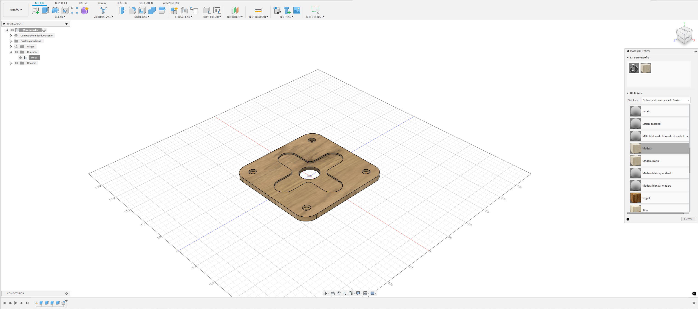
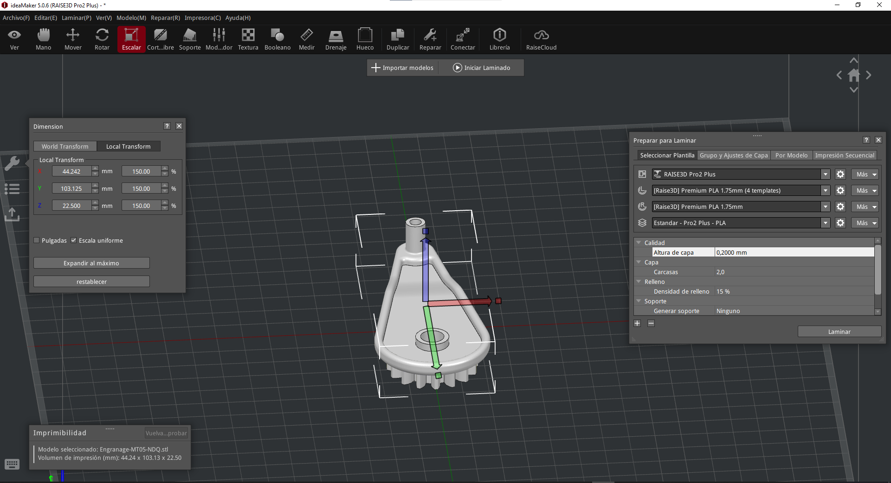
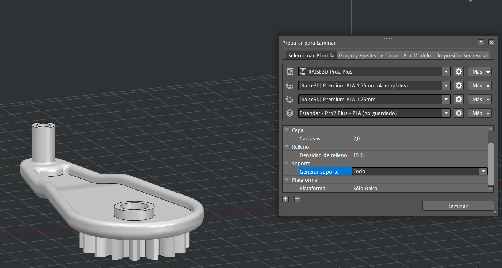
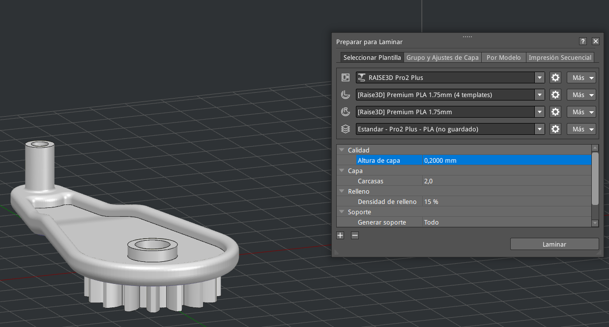
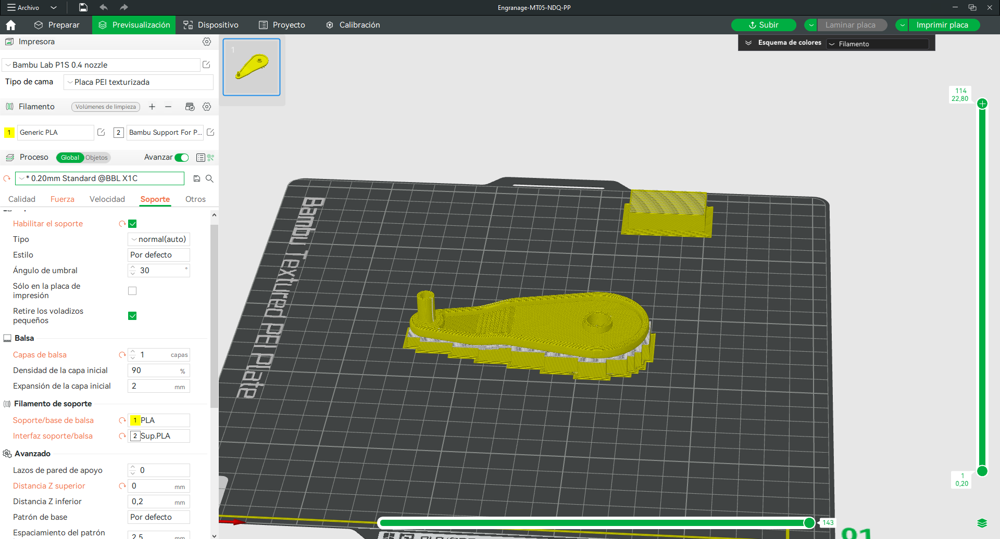
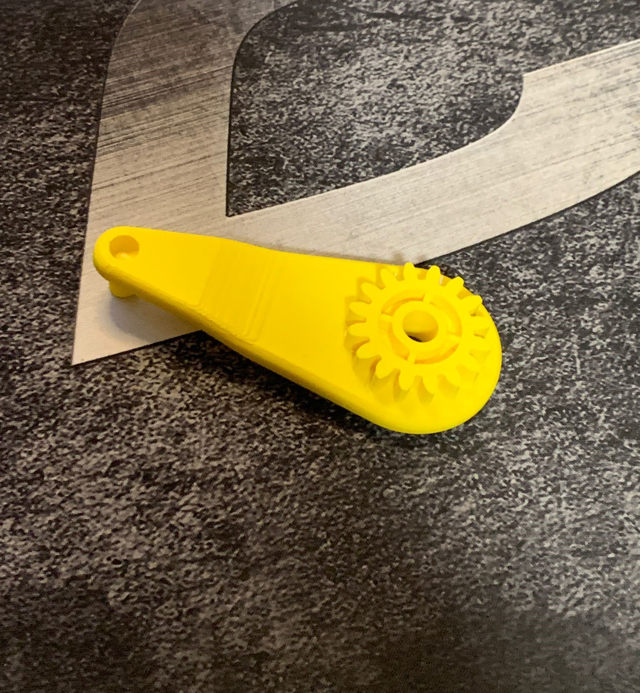
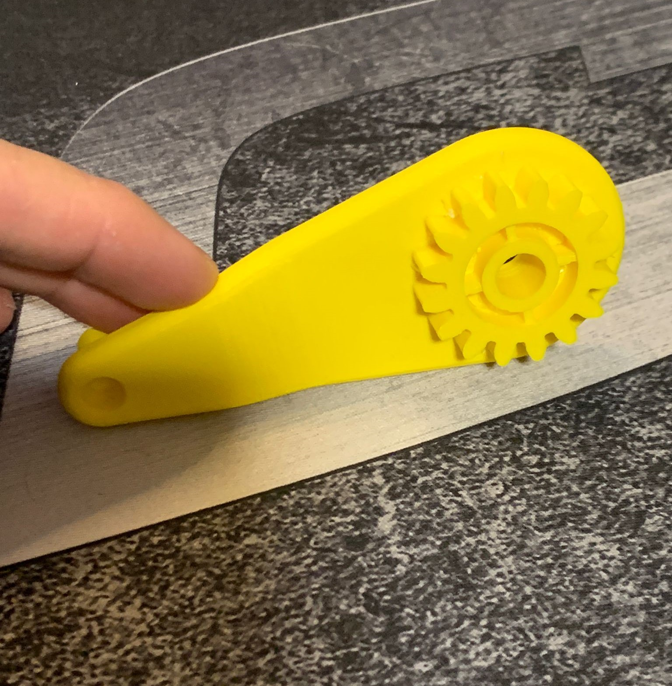

---
hide:
    - toc
---

# MT08 - Control Numérico Computarizado (CNC)

## Introducción

El módulo de Control Numérico Computarizado (CNC) es una parte esencial del eje de tecnología y fabricación dentro de la Especialización en Fabricación Digital e Innovación. Este módulo está diseñado para llevarnos más allá de los conceptos teóricos y meternos en la aplicación práctica de las tecnologías CNC, que juegan un papel crucial en la fabricación moderna.

El control numérico computarizado nos permite automatizar y precisar el proceso de fabricación a través de la programación de máquinas. Estas máquinas pueden cortar, fresar, perforar y moldear materiales con una precisión milimétrica, transformando diseños digitales en piezas físicas con alta exactitud. Durante este módulo, vamos a ver las técnicas de programación en CNC, los diferentes tipos de máquinas herramientas, y los materiales que se pueden trabajar. Además, aprenderemos a interpretar planos y diseñar trayectorias de corte optimizadas.

El uso de CNC ha revolucionado la producción en sectores como la manufactura, la ingeniería y el diseño industrial, permitiendo la creación de piezas complejas y de alta calidad con eficiencia y repetibilidad. Como entrega final de este módulo se espera un proyecto práctico que nos permitirán aplicar los conocimientos adquiridos, enfrentar desafíos reales y perfeccionar habilidades fundamentales en la industria de la fabricación digital.

En este módulo el tutor fue Maximiliano Torres.

Para llevar a cabo este módulo vimos diferentes herramientas como lo son: 

## Fusion 360

{ align=left }

Fusion 360 es una potente plataforma de diseño asistido por computadora (CAD), modelado 3D, simulación y fabricación desarrollada por Autodesk. Es una herramienta integral que combina varias funciones esenciales para el diseño y la ingeniería en una sola aplicación.

Una de las características distintivas de Fusion 360 es su enfoque en el diseño colaborativo basado en la nube. Esto significa que múltiples usuarios pueden trabajar en un mismo proyecto simultáneamente desde diferentes ubicaciones, lo que facilita la colaboración en equipos distribuidos.

Fusion 360 ofrece una amplia gama de herramientas de modelado 3D, incluidas opciones para esculpir, crear superficies orgánicas y diseñar piezas mecánicas. También incluye capacidades de simulación para evaluar el rendimiento y la resistencia de los diseños antes de la fabricación.

Además, Fusion 360 integra herramientas de fabricación asistida por computadora (CAM), lo que permite a los usuarios generar trayectorias de herramientas para máquinas de control numérico por computadora (CNC) y llevar a cabo la fabricación de prototipos y productos finales.

## Proceso Realizado

Para la actividad del MT08, se nos solicitaba realizar un ejercicio para poner en práctica los conocimientos adquiridos en el módulo, realizando una actividad con varias consignas: descargar el archivo de fusion(.f3d), abrir el archivo en fusion 360, agregar una máquina al proyecto, configurar su postprocesador y realizar varias operaciones/estrategias de mecanizado como: 2d cajeras, taladreado y contorneado, el resultado de todo lo anterior, resultó en la generación de un archivo .nc listo para utilizarlo en la máquina y ejecutar el mecanizado en ella, aquí debajo detallaré los pasos seguidos:

## Imagenes del Proceso - Fusion 360

Primeramente, descargué el archivo del link brindado, abriendolo con Fusion 360:

<figure markdown="span">
  { width="600"}
</figure>

Aplicamos el material de la pieza a utilizar, en este caso Madera:

<figure markdown="span">
  { width="600"}
</figure>

Con el material a utilizar puesto, paso al post procesador, una vez descargado, configuro la máquina y el postprocesador asociado a ella:

<figure markdown="span">
  { width="600"}
</figure>

<figure markdown="span">
  { width="600"}
</figure>

En este punto realicé un escalado al 150% de la pieza como solicitaba el paso a paso:

<figure markdown="span">
  { width="600"}
</figure>

Luego, configuré los soportes, la balsa, la cantidad de paredes y realicé la configuración para que se imprimiera con el extrusor izquierdo:

<figure markdown="span">
  { width="600"}
</figure>

<figure markdown="span">
  { width="600"}
</figure>

<figure markdown="span">
  { width="600"}
</figure>

Finalmente una previsualización para ver como se va a imprimir el modelo y posterior a ello, exporté el archivo .gcode:

<figure markdown="span">
  { width="600"}
</figure>

## Imagenes del Proceso - Bambu Studio

Dejaré por aquí las imágenes de la configuración realizada en Bambu Studio, la cual sigue los mismos parámetros anteriormente mencionados:

<figure markdown="span">
  { width="600"}
</figure>

<figure markdown="span">
  { width="600"}
</figure>

<figure markdown="span">
  { width="600"}
</figure>

## Timelapse de Impresión - Bambu Studio

<iframe width="1903" height="750" src="https://www.youtube.com/embed/dm5FtoL80FQ" title="Proyecto MT05 - EFDI - NDQ - Timelapse de Impresión de Pieza" frameborder="0" allow="accelerometer; autoplay; clipboard-write; encrypted-media; gyroscope; picture-in-picture; web-share" referrerpolicy="strict-origin-when-cross-origin" allowfullscreen></iframe>

## Pieza Finalizada - Bambu Lab P1S

<figure markdown="span">
  { width="600"}
</figure>

<figure markdown="span">
  { width="600"}
</figure>

<figure markdown="span">
  { width="600"}
</figure>

<figure markdown="span">
  { width="600"}
</figure>

<figure markdown="span">
  { width="600"}
</figure>

## Conclusiones del Proyecto

El Módulo MT05 ha sido una experiencia increíblemente enriquecedora para mí, permitiéndome profundizar en el vasto y dinámico campo de la impresión 3D. A lo largo de este módulo, he tenido la oportunidad de explorar y dominar diversas tecnologías y herramientas que me han permitido transformar mis ideas de diseño digital en realidades físicas tangibles. La culminación de este módulo fue la realización de un proyecto integral que puso a prueba todas las habilidades y conocimientos que he adquirido, centrándome en la optimización y preparación de archivos STL para impresión en los softwares ideaMaker y Bambu Studio, después de haberlos exportado desde Fusion 360.

En este proyecto, comencé descargando un modelo 3D en Fusion 360, un potente software de diseño asistido por computadora (CAD). La transición de este modelo desde el entorno de diseño hasta el proceso de impresión fue un paso crucial. Exporté mi modelo como archivos STL, un formato estándar en la impresión 3D que define la geometría de los objetos de manera triangular. Este proceso me enseñó la importancia de una correcta configuración de exportación para asegurar que los modelos sean fieles a mi intención de diseño y estén optimizados para el siguiente paso en el flujo de trabajo.

Una vez que el archivo STL estuvo listo, lo importé a ideaMaker y Bambu Studio, dos softwares de laminado y gestión de impresión 3D que ofrecen una amplia gama de herramientas para la preparación y optimización de impresiones. En ideaMaker, trabajé con diversas configuraciones de impresión, ajustando parámetros como la altura de capa, la densidad de relleno y la velocidad de impresión. La capacidad de ideaMaker para generar soportes automáticamente me permitió asegurar que las piezas fueran imprimibles sin problemas y con una alta calidad. Exploré las diferentes opciones de configuración para balancear la calidad de impresión con la eficiencia del tiempo y el uso de material, aprendiendo a tomar decisiones informadas basadas en las necesidades específicas de cada proyecto.

Simultáneamente, utilicé Bambu Studio para llevar a cabo una tarea similar, explorando su conjunto de características avanzadas que incluyen la optimización inteligente de soportes y la simulación del proceso de impresión. Bambu Studio me ofreció una visión detallada de cada capa del modelo, permitiéndome prever y corregir posibles problemas antes de iniciar la impresión. La integración de herramientas de análisis y simulación fue particularmente valiosa, ya que me permitió identificar y resolver errores que podrían haber afectado la calidad final de mis impresiones. Además, la capacidad de gestionar perfiles de impresora y materiales de manera eficiente en Bambu Studio me facilitó el manejo de diferentes proyectos y la reutilización de configuraciones exitosas.

El proyecto culminó con la impresión exitosa de el modelo 3D, donde pude ver materializadas mis ideas y diseños. Este proceso me enseñó no solo las habilidades técnicas necesarias para manejar softwares de laminado avanzados, sino también la importancia de una planificación y optimización meticulosa en cada etapa del flujo de trabajo de impresión 3D. Aprendí a evaluar y ajustar parámetros con precisión, a utilizar herramientas de análisis para mejorar la calidad de mis impresiones y a gestionar eficientemente los recursos disponibles.

En resumen, el Módulo MT05 me ha proporcionado una comprensión profunda y práctica de la impresión y el escaneo 3D. He desarrollado habilidades críticas que son altamente valoradas en la industria de la fabricación digital, y he adquirido la confianza para enfrentar desafíos complejos en la impresión 3D. El conocimiento y la experiencia ganados en este módulo me preparan para seguir innovando y explorando las posibilidades ilimitadas que ofrece la fabricación aditiva. A medida que avanzo en mi carrera en la fabricación digital, llevo conmigo las lecciones aprendidas y las habilidades desarrolladas en este módulo, listo para aplicarlas en futuros proyectos y continuar expandiendo los límites de lo que es posible con la impresión y el escaneo 3D.

## Archivos del Proyecto

*[Archivo de Fusion 360 (Provisto por el Docente)](../archives/Entrega_MecanizadoMTO8.f3d)*
*[Archivo de Fusion 360 - Postprocesador Utilizado (f360-easel.cps)](../archives/f360-easel.cps)*
*[Export de Archivo de Fusion 360 (.nc listo)](../archives/NicolásDuarte.nc)*

