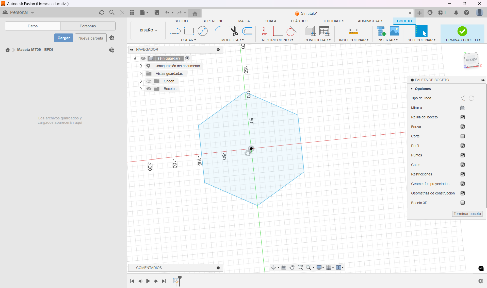
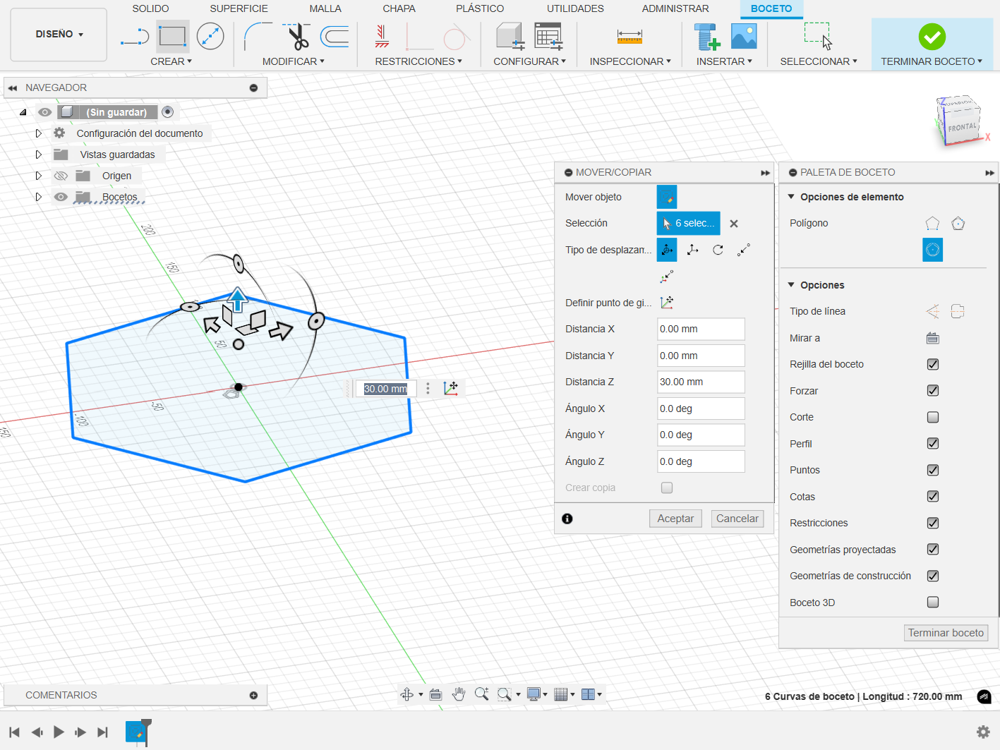
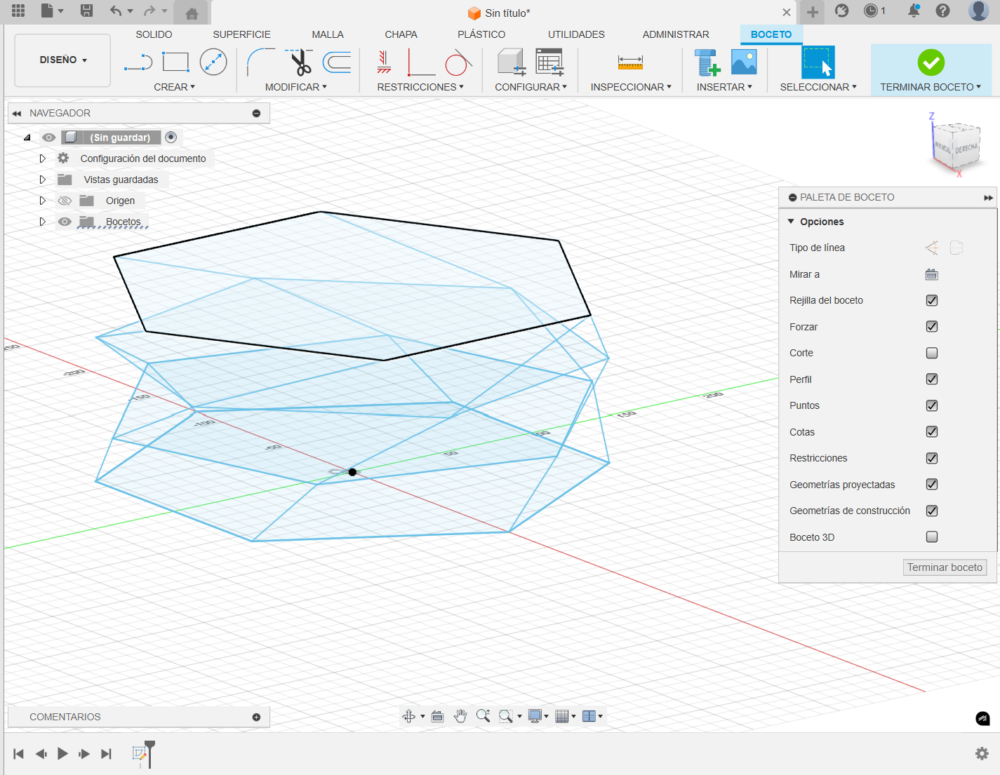
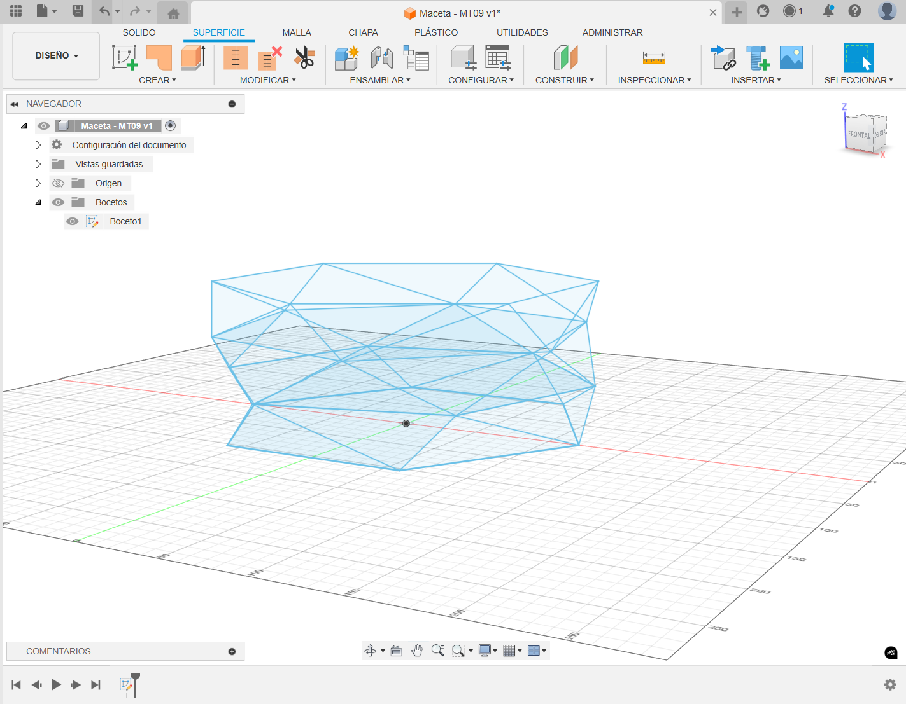
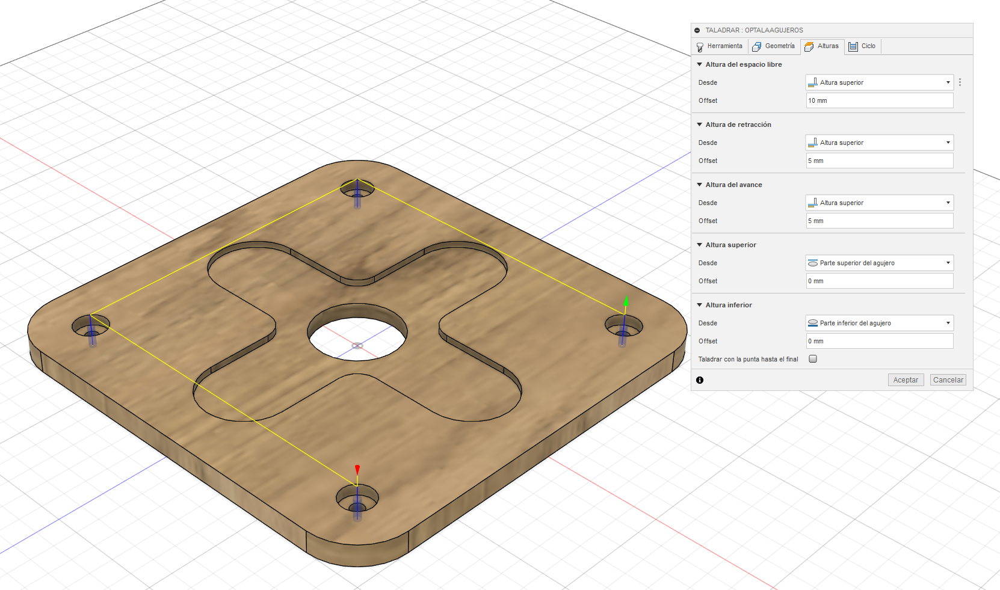
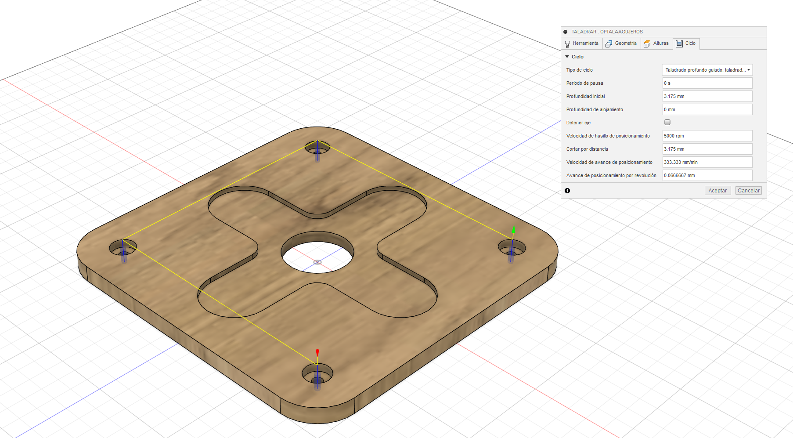
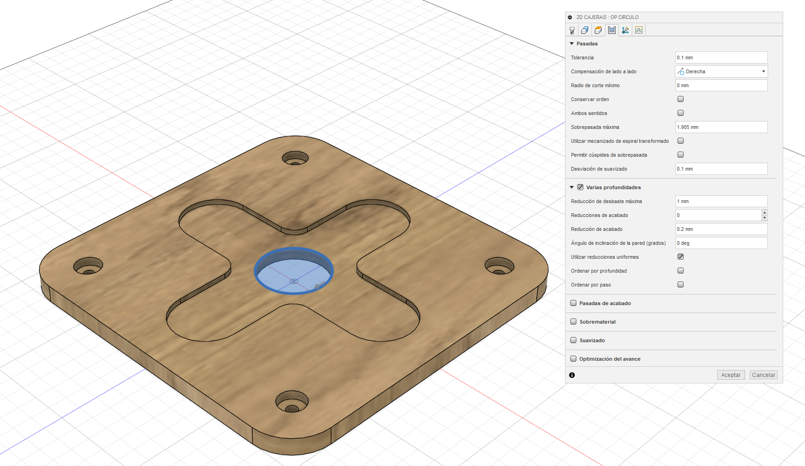
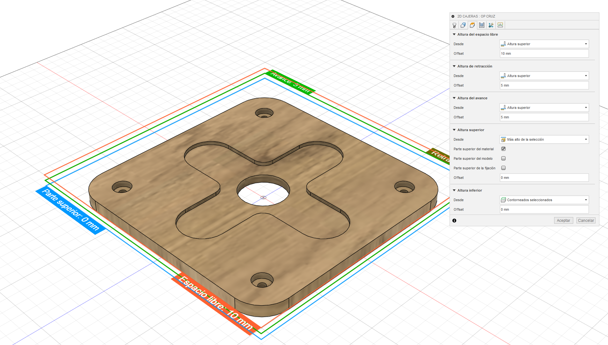
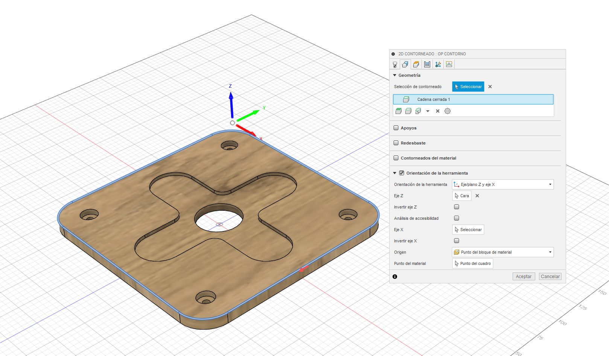
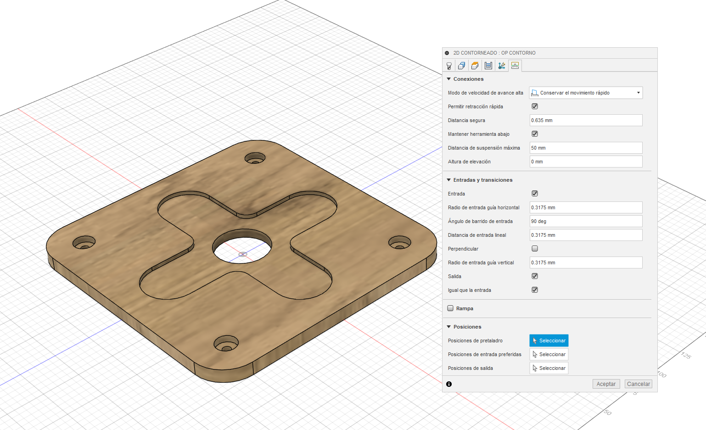

---
hide:
    - toc
---

# MT09 - Moldes

## Introducción

El módulo de Moldes (MT09) es una etapa clave en la Especialización en Fabricación Digital e Innovación, porque nos ayuda a adentrarnos en un proceso que resulta esencial para la producción en serie: la creación de moldes. A diferencia de otros módulos en los que trabajamos directamente con la fabricación de piezas, aquí vamos a enfocarnos en cómo se diseñan y fabrican los moldes que permiten reproducir esas piezas de una manera más eficiente.

Durante este módulo, vimos diferentes métodos de moldeo, como la inyección, fundición y termoformado, y entendimos el cómo se elige la técnica adecuada dependiendo del material y la complejidad del diseño. Lo interesante es que no se trata solo de aprender a crear un molde, sino de entender cómo optimizarlo para mejorar tanto la calidad de las piezas como el proceso de producción.

A lo largo de las clases, vimos desde la teoría hasta la práctica, aplicando lo aprendido para diseñar y producir un molde real que sea funcional. Al final, la idea, bajo mi entender, es que cada uno de nosotros termine este módulo no solo con nuevas habilidades, sino también con una visión más amplia de cómo la fabricación eficiente y a gran escala empieza mucho antes de que las máquinas se pongan en marcha.

En este módulo el tutora fue Julia Leirado.

Para llevar a cabo este módulo vimos diferentes herramientas como lo son: 

## Fusion 360

{ align=left }

Fusion 360 es una potente plataforma de diseño asistido por computadora (CAD), modelado 3D, simulación y fabricación desarrollada por Autodesk. Es una herramienta integral que combina varias funciones esenciales para el diseño y la ingeniería en una sola aplicación.

Una de las características distintivas de Fusion 360 es su enfoque en el diseño colaborativo basado en la nube. Esto significa que múltiples usuarios pueden trabajar en un mismo proyecto simultáneamente desde diferentes ubicaciones, lo que facilita la colaboración en equipos distribuidos.

Fusion 360 ofrece una amplia gama de herramientas de modelado 3D, incluidas opciones para esculpir, crear superficies orgánicas y diseñar piezas mecánicas. También incluye capacidades de simulación para evaluar el rendimiento y la resistencia de los diseños antes de la fabricación.

Además, Fusion 360 integra herramientas de fabricación asistida por computadora (CAM), lo que permite a los usuarios generar trayectorias de herramientas para máquinas de control numérico por computadora (CNC) y llevar a cabo la fabricación de prototipos y productos finales.

## Proceso Realizado

Para la actividad del módulo, se nos pedia diseñar y modelar una maceta con ciertas dimensiones máximas, aplicando los conceptos vistos en el módulo sobre diseño y fabricación de moldes. El ejercicio consiste en seguir una serie de consignas que nos llevarán desde el diseño del objeto hasta la creación de un molde funcional en Fusion 360.

Primero, debemos diseñar una maceta con un alto máximo de 10 cm y un diámetro de 15 cm. Una vez diseñado el modelo de la maceta, lo modelaremos en Fusion 360. Luego, pasaremos a diseñar un molde que pueda fabricarla, respetando las restricciones de tener entre 1 y 4 caras, y añadiendo guías de encastre en caso de que el molde tenga más de una cara.

Después de modelar tanto la maceta como el molde, ambos deben estar en un único archivo .f3d que se enviará al docente Maximiliano por correo

Aquí debajo detallaré los pasos seguidos:

## Imagenes del Proceso - Fusion 360

Primeramente, comencé a diseñar la maceta, utilizando hexagonos en su sketch, a diferentes alturas, para luego ir uniendo las aristas de cada uno de los niveles, para generar un sketch más complejo:

<figure markdown="span">
  { width="600"}
</figure>

<figure markdown="span">
  { width="600"}
</figure>

<figure markdown="span">
  { width="600"}
</figure>

<figure markdown="span">
  { width="600"}
</figure>

<figure markdown="span">
  { width="600"}
</figure>

Configuramos el eje de trabajo:

<figure markdown="span">
  { width="600"}
</figure>

Con esto estaríamos listos para pasar a las diferentes operaciones, comenzando con el Taladrado, aquí la configuración que utilicé para realizar la operación:

<figure markdown="span">
  { width="600"}
</figure>

<figure markdown="span">
  { width="600"}
</figure>

<figure markdown="span">
  { width="600"}
</figure>

<figure markdown="span">
  { width="600"}
</figure>

Para la siguiente operación, realicé la Cajera para el circulo central de la pieza, aquí la configuración que utilicé para realizar la operación:

<figure markdown="span">
  { width="600"}
</figure>

<figure markdown="span">
  { width="600"}
</figure>

<figure markdown="span">
  { width="600"}
</figure>

<figure markdown="span">
  { width="600"}
</figure>

<figure markdown="span">
  { width="600"}
</figure>

<figure markdown="span">
  { width="600"}
</figure>

Luego pasé a la cajera que realizaría la cruz redondeada del centro, aquí la configuración que utilicé para realizar la operación:

<figure markdown="span">
  { width="600"}
</figure>

<figure markdown="span">
  { width="600"}
</figure>

<figure markdown="span">
  { width="600"}
</figure>

<figure markdown="span">
  { width="600"}
</figure>

<figure markdown="span">
  { width="600"}
</figure>

<figure markdown="span">
  { width="600"}
</figure>

Luego las cajeras que recorren cada uno de los taladros realizados anteriormente, aquí la configuración que utilicé para realizar la operación:

<figure markdown="span">
  { width="600"}
</figure>

<figure markdown="span">
  { width="600"}
</figure>
<figure markdown="span">
  { width="600"}
</figure>

<figure markdown="span">
  { width="600"}
</figure>

<figure markdown="span">
  { width="600"}
</figure>

<figure markdown="span">
  { width="600"}
</figure>

Finalmente, pasé a la operación de Contorno, para justamente contornear la pieza a su modelo final, aquí la configuración que utilicé para realizar la operación:

<figure markdown="span">
  { width="600"}
</figure>

<figure markdown="span">
  { width="600"}
</figure>

<figure markdown="span">
  { width="600"}
</figure>

<figure markdown="span">
  { width="600"}
</figure>

<figure markdown="span">
  { width="600"}
</figure>

<figure markdown="span">
  { width="600"}
</figure>

Para exportar el proyecto luego, en el menú de Acciones, opción de PostProcesar:

<figure markdown="span">
  { width="600"}
</figure>

## Videos del Proyecto

Muestra de la simulación con todas las operaciones anteriormente detalladas:

<iframe width="1903" height="750" src="https://www.youtube.com/embed/jbJBjsi88GA?si=-5WYa-TKSHs5MBYy" title="Video Simulación Operaciones CNC - MT08 - EFDI - NDQ" frameborder="0" allow="accelerometer; autoplay; clipboard-write; encrypted-media; gyroscope; picture-in-picture; web-share" referrerpolicy="strict-origin-when-cross-origin" allowfullscreen></iframe>

## Conclusiones del Proyecto

El módulo MT08 ha sido una experiencia transformadora en nuestro recorrido por la fabricación digital. A lo largo de este módulo, he tenido la oportunidad de meterme en el mundo del control numérico computarizado, una tecnología que, sin duda, está marcando el futuro de la manufactura y que personalmente nunca había tenido la oportunidad de explorar.

Desde aprender a programar y operar máquinas CNC hasta enfrentar desafíos prácticos en la creación de piezas con precisión milimétrica, cada aspecto de este módulo ha sido una experiencia muy positiva. El proyecto que llevé a cabo no solo ha puesto a prueba mis habilidades técnicas, sino que también me mostró el impacto real y tangible de la tecnología CNC.

El conocimiento y las habilidades adquiridas en MT08 no solo amplían mis capacidades en la fabricación, sino que también me preparan para ser más innovador en un campo que está en constante evolución. Ahora, tengo las herramientas para abordar proyectos más complejos y contribuir significativamente a la creación de productos de alta calidad.

Finalizando comentar que este módulo ha sido más que una lección técnica; ha sido una oportunidad para explorar y dominar un poco, una tecnología clave que impulsa la innovación en la fabricación digital.

## Archivos del Proyecto

*[Archivo de Fusion 360 (Provisto por el Docente)](../archives/Entrega_MecanizadoMTO8.f3d)*

*[Archivo de Fusion 360 - Postprocesador Utilizado (f360-easel.cps)](../archives/f360-easel.cps)*

*[Export de Archivo de Fusion 360 (.nc listo)](../archives/NicolásDuarte.nc)*

